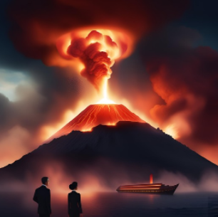{width="4.35169in" height="6.53646in"}

Paul Koop

Omega Poems

Metaphysical meditations on consciousness, time and the divine Omega point

Omega Poesie

Metaphysische Meditationen über Bewusstsein, Zeit und den göttlichen Omegapunkt

Inhaltsverzeichnis

[**The Great or Nicene-Constantinopolitan Creed 3**](#the-great-or-nicene-constantinopolitan-creed)

> [The Great or Nicene-Constantinopolitan Creed 3](#the-great-or-nicene-constantinopolitan-creed-1)

[**Das Große oder Nicäno-Konstantinopolitanische Glaubensbekenntnis 4**](#das-grouxdfe-oder-nicuxe4no-konstantinopolitanische-glaubensbekenntnis)

> [Das Große oder Nicäno-Konstantinopolitanische Glaubensbekenntnis 4](#das-grouxdfe-oder-nicuxe4no-konstantinopolitanische-glaubensbekenntnis-1)

[**The Search for Unity: A Metaphysical Journey to the Omega Point 5**](#the-search-for-unity-a-metaphysical-journey-to-the-omega-point)

[**Die Suche nach Einheit: Eine metaphysische Reise zum Omegapunkt 9**](#die-suche-nach-einheit-eine-metaphysische-reise-zum-omegapunkt)

[**Summary of the chapters 13**](#summary-of-the-chapters)

[**Zusammenfassung der Kapitel 16**](#zusammenfassung-der-kapitel)

[**Pencil - Bleistift 19**](#pencil---bleistift)

[**The Island of Being - Die Insel des Seins 21**](#the-island-of-being---die-insel-des-seins)

[**Monistic and Trinitarian confession - Monistisches und trinitarisches Bekenntnis 27**](#monistic-and-trinitarian-confession---monistisches-und-trinitarisches-bekenntnis)

[**Between Vanilla Ice Cream and the Dentist -- On the Structure of Consciousness in a Possible World - Zwischen Vanilleeis und Zahnarzt -- Über die Struktur des Bewusstseins in einer möglichen Welt 31**](#between-vanilla-ice-cream-and-the-dentist-on-the-structure-of-consciousness-in-a-possible-world---zwischen-vanilleeis-und-zahnarzt-uxfcber-die-struktur-des-bewusstseins-in-einer-muxf6glichen-welt)

[**The Paradox of Knowledge and the Threshold of Infinity - Das Paradoxon des Wissens und die Schwelle zur Unendlichkeit 35**](#the-paradox-of-knowledge-and-the-threshold-of-infinity---das-paradoxon-des-wissens-und-die-schwelle-zur-unendlichkeit)

[**Omega Point - Omegapunkt 38**](#omega-point---omegapunkt)

[**Ever near, yet never reached - Immer näher, nie erreicht 40**](#ever-near-yet-never-reached---immer-nuxe4her-nie-erreicht)

[**At the Omega Point - Am Omegapunkt 45**](#at-the-omega-point---am-omegapunkt)

[**Network of Light -- Toward the Omega Point - Netz aus Licht -- Zum Omegapunkt 47**](#network-of-light-toward-the-omega-point---netz-aus-licht-zum-omegapunkt)

[**Omega Point- Omegapunkt 50**](#omega-point--omegapunkt)

[**Omega Liturgy - Omega-Liturgie 52**](#omega-liturgy---omega-liturgie)

[**Omega Point - Omegapunkt 54**](#omega-point---omegapunkt-1)

[**At the Omega Point - Am Omega-Punkt 57**](#at-the-omega-point---am-omega-punkt)

[**Masks of life's unending course - Gestalten im Lebenslang 59**](#masks-of-lifes-unending-course---gestalten-im-lebenslang)

[**The God of a monistic, eschatological Omega Point belief - Der Gott eines monistischen, eschatologischen Omegapunktglaubens 62**](#the-god-of-a-monistic-eschatological-omega-point-belief---der-gott-eines-monistischen-eschatologischen-omegapunktglaubens)

[**Worldview of a Monistic Metaphysics - Weltbild einer monistischen Metaphysik 64**](#worldview-of-a-monistic-metaphysics---weltbild-einer-monistischen-metaphysik)

#  The Great or Nicene-Constantinopolitan Creed

+:------------------------------------------------------------------------------------------------------------------------------------------------------------------------------------------------------------------------------------------------------------------------------------------------------+:---------------------------------------------------------------------------------------------------------------------------------------------------------------------------------------------------------------------------------------------------------------------------+
| ::: minipage                                                                                                                                                                                                                                                                                          | ::: minipage                                                                                                                                                                                                                                                               |
| ### The Great or Nicene-Constantinopolitan Creed                                                                                                                                                                                                                                                      | My interpretation                                                                                                                                                                                                                                                          |
| :::                                                                                                                                                                                                                                                                                                   | :::                                                                                                                                                                                                                                                                        |
+-------------------------------------------------------------------------------------------------------------------------------------------------------------------------------------------------------------------------------------------------------------------------------------------------------+----------------------------------------------------------------------------------------------------------------------------------------------------------------------------------------------------------------------------------------------------------------------------+
| ::: minipage                                                                                                                                                                                                                                                                                          | ::: minipage                                                                                                                                                                                                                                                               |
| I believe in one God,                                                                                                                                                                                                                                                                                 | I believe in the One and All is One.                                                                                                                                                                                                                                       |
| :::                                                                                                                                                                                                                                                                                                   | :::                                                                                                                                                                                                                                                                        |
+-------------------------------------------------------------------------------------------------------------------------------------------------------------------------------------------------------------------------------------------------------------------------------------------------------+----------------------------------------------------------------------------------------------------------------------------------------------------------------------------------------------------------------------------------------------------------------------------+
| ::: minipage                                                                                                                                                                                                                                                                                          | ::: minipage                                                                                                                                                                                                                                                               |
| the Father Almighty, who created everything, heaven and earth, the visible and the invisible world.                                                                                                                                                                                                   | The almighty potential of all possibilities, the beginning, of our world and all possible worlds, before all time and outside of space and time, invisible to one another, visible to itself. All form of the same form and all substance of the same substance.           |
| :::                                                                                                                                                                                                                                                                                                   | :::                                                                                                                                                                                                                                                                        |
+-------------------------------------------------------------------------------------------------------------------------------------------------------------------------------------------------------------------------------------------------------------------------------------------------------+----------------------------------------------------------------------------------------------------------------------------------------------------------------------------------------------------------------------------------------------------------------------------+
| ::: minipage                                                                                                                                                                                                                                                                                          | ::: minipage                                                                                                                                                                                                                                                               |
| And in one Lord Jesus Christ, the only Son of God, born of the Father before all ages, God from God, Light from Light, true God from true God, begotten, not made, of one being with the Father; through him all things were created.                                                                 | And to the omniscient end outside of space and time. Knowing all (indistinguishable from knowing and risen, therefore, like us, begotten, not created, born, knowing, conscientious, lived, loved, suffered, risen, of one being and indistinguishable from the beginning. |
|                                                                                                                                                                                                                                                                                                       | :::                                                                                                                                                                                                                                                                        |
| For us humans and for our salvation he came down from heaven, took on flesh through the Holy Spirit of the Virgin Mary and became man.                                                                                                                                                                |                                                                                                                                                                                                                                                                            |
|                                                                                                                                                                                                                                                                                                       |                                                                                                                                                                                                                                                                            |
| He was crucified for us under Pontius Pilate, suffered and was buried, rose again on the third day according to the Scriptures, and ascended into heaven. He sits at the right hand of the Father and will come again in glory to judge the living and the dead. Of his kingdom there will be no end. |                                                                                                                                                                                                                                                                            |
| :::                                                                                                                                                                                                                                                                                                   |                                                                                                                                                                                                                                                                            |
+-------------------------------------------------------------------------------------------------------------------------------------------------------------------------------------------------------------------------------------------------------------------------------------------------------+----------------------------------------------------------------------------------------------------------------------------------------------------------------------------------------------------------------------------------------------------------------------------+
| ::: minipage                                                                                                                                                                                                                                                                                          | ::: minipage                                                                                                                                                                                                                                                               |
| I believe in the Holy Spirit, the Lord and giver of life, who proceeds from the Father and the Son, who with the Father and the Son is worshipped and glorified, who spoke through the prophets,                                                                                                      | And I believe in the all-living (co-knowing, realizing) and dominating possible worlds (possibilities, superimposing, reinforcing), before all time and outside of space and time, of one being and indistinguishable from beginning and end.                              |
| :::                                                                                                                                                                                                                                                                                                   | :::                                                                                                                                                                                                                                                                        |
+-------------------------------------------------------------------------------------------------------------------------------------------------------------------------------------------------------------------------------------------------------------------------------------------------------+----------------------------------------------------------------------------------------------------------------------------------------------------------------------------------------------------------------------------------------------------------------------------+
| ::: minipage                                                                                                                                                                                                                                                                                          | ::: minipage                                                                                                                                                                                                                                                               |
| and one, holy, catholic, and apostolic Church. I confess one baptism for the forgiveness of sins.                                                                                                                                                                                                     | And the one, holy, universal community, born of the incarnation of the omniscient End, which raises us up anew.                                                                                                                                                            |
| :::                                                                                                                                                                                                                                                                                                   | :::                                                                                                                                                                                                                                                                        |
+-------------------------------------------------------------------------------------------------------------------------------------------------------------------------------------------------------------------------------------------------------------------------------------------------------+----------------------------------------------------------------------------------------------------------------------------------------------------------------------------------------------------------------------------------------------------------------------------+
| ::: minipage                                                                                                                                                                                                                                                                                          | ::: minipage                                                                                                                                                                                                                                                               |
| I await the resurrection of the dead and the life of the world to come.                                                                                                                                                                                                                               | I await the resurrection of all those who have lived and could have lived (omniscient, all possibilities, co-knowledge, conscientia) and eternal life on a new earth and under a new heaven in new bodies.                                                                 |
| :::                                                                                                                                                                                                                                                                                                   | :::                                                                                                                                                                                                                                                                        |
+-------------------------------------------------------------------------------------------------------------------------------------------------------------------------------------------------------------------------------------------------------------------------------------------------------+----------------------------------------------------------------------------------------------------------------------------------------------------------------------------------------------------------------------------------------------------------------------------+
| ::: minipage                                                                                                                                                                                                                                                                                          | ::: minipage                                                                                                                                                                                                                                                               |
| Amen.                                                                                                                                                                                                                                                                                                 | Amen.                                                                                                                                                                                                                                                                      |
| :::                                                                                                                                                                                                                                                                                                   | :::                                                                                                                                                                                                                                                                        |
+-------------------------------------------------------------------------------------------------------------------------------------------------------------------------------------------------------------------------------------------------------------------------------------------------------+----------------------------------------------------------------------------------------------------------------------------------------------------------------------------------------------------------------------------------------------------------------------------+
|                                                                                                                                                                                                                                                                                                       |                                                                                                                                                                                                                                                                            |
+-------------------------------------------------------------------------------------------------------------------------------------------------------------------------------------------------------------------------------------------------------------------------------------------------------+----------------------------------------------------------------------------------------------------------------------------------------------------------------------------------------------------------------------------------------------------------------------------+

# Das Große oder Nicäno-Konstantinopolitanische Glaubensbekenntnis {#das-grouxdfe-oder-nicuxe4no-konstantinopolitanische-glaubensbekenntnis}

+:-------------------------------------------------------------------------------------------------------------------------------------------------------------------------------------------------------------------------------------------------------------------------------------------------------------------------------+:------------------------------------------------------------------------------------------------------------------------------------------------------------------------------------------------------------------------------------------------------------------------------------------------------------------+
| ::: minipage                                                                                                                                                                                                                                                                                                                   | ::: minipage                                                                                                                                                                                                                                                                                                      |
| ### Das Große oder Nicäno-Konstantinopolitanische Glaubensbekenntnis {#das-grouxdfe-oder-nicuxe4no-konstantinopolitanische-glaubensbekenntnis-1}                                                                                                                                                                               | Meine Interpretation                                                                                                                                                                                                                                                                                              |
| :::                                                                                                                                                                                                                                                                                                                            |                                                                                                                                                                                                                                                                                                                   |
|                                                                                                                                                                                                                                                                                                                                | (Was mir nicht zusteht, denn es gibt das Lehramt)                                                                                                                                                                                                                                                                 |
|                                                                                                                                                                                                                                                                                                                                | :::                                                                                                                                                                                                                                                                                                               |
+--------------------------------------------------------------------------------------------------------------------------------------------------------------------------------------------------------------------------------------------------------------------------------------------------------------------------------+-------------------------------------------------------------------------------------------------------------------------------------------------------------------------------------------------------------------------------------------------------------------------------------------------------------------+
| ::: minipage                                                                                                                                                                                                                                                                                                                   | ::: minipage                                                                                                                                                                                                                                                                                                      |
| Ich glaube an den einen Gott,                                                                                                                                                                                                                                                                                                  | Ich glaube an das Eine und Alles ist Eines.                                                                                                                                                                                                                                                                       |
| :::                                                                                                                                                                                                                                                                                                                            | :::                                                                                                                                                                                                                                                                                                               |
+--------------------------------------------------------------------------------------------------------------------------------------------------------------------------------------------------------------------------------------------------------------------------------------------------------------------------------+-------------------------------------------------------------------------------------------------------------------------------------------------------------------------------------------------------------------------------------------------------------------------------------------------------------------+
| ::: minipage                                                                                                                                                                                                                                                                                                                   | ::: minipage                                                                                                                                                                                                                                                                                                      |
| den Vater, den Allmächtigen, der alles geschaffen hat, Himmel und Erde, die sichtbare und die unsichtbare Welt.                                                                                                                                                                                                                | Das allmächtige Potential aller Möglichkeiten, Anfang, unserer Welt und aller möglichen Welten, vor aller Zeit und außerhalb von Raum und Zeit, füreinander unsichtbar, für sich selbst sichtbar. Alle Form von gleicher Form und alle Substanz von gleicher Substanz.                                            |
| :::                                                                                                                                                                                                                                                                                                                            | :::                                                                                                                                                                                                                                                                                                               |
+--------------------------------------------------------------------------------------------------------------------------------------------------------------------------------------------------------------------------------------------------------------------------------------------------------------------------------+-------------------------------------------------------------------------------------------------------------------------------------------------------------------------------------------------------------------------------------------------------------------------------------------------------------------+
| ::: minipage                                                                                                                                                                                                                                                                                                                   | ::: minipage                                                                                                                                                                                                                                                                                                      |
| Und an den einen Herrn Jesus Christus, Gottes eingeborenen Sohn, aus dem Vater geboren vor aller Zeit: Gott von Gott, Licht vom Licht, wahrer Gott vom wahren Gott, gezeugt, nicht geschaffen, eines Wesens mit dem Vater; durch ihn ist alles geschaffen.                                                                     | Und an das allwissende Ende außerhalb von Raum und Zeit. Alles wissend (ununterscheidbar von mitwissen und auferstanden, deshalb wie wir gezeugt, nicht geschaffen, geboren, mitwissend, vergegenwärtigend, (Conscientia), gelebt, geliebt, gelitten, auferstanden, eines Wesens und ununterscheidbar vom Anfang. |
|                                                                                                                                                                                                                                                                                                                                | :::                                                                                                                                                                                                                                                                                                               |
| Für uns Menschen und zu unserem Heil ist er vom Himmel gekommen, hat Fleisch angenommen durch den Heiligen Geist von der Jungfrau Maria und ist Mensch geworden.                                                                                                                                                               |                                                                                                                                                                                                                                                                                                                   |
|                                                                                                                                                                                                                                                                                                                                |                                                                                                                                                                                                                                                                                                                   |
| Er wurde für uns gekreuzigt unter Pontius Pilatus, hat gelitten und ist begraben worden, ist am dritten Tage auferstanden nach der Schrift und aufgefahren in den Himmel. Er sitzt zur Rechten des Vaters und wird wiederkommen in Herrlichkeit, zu richten die Lebenden und die Toten; seiner Herrschaft wird kein Ende sein. |                                                                                                                                                                                                                                                                                                                   |
| :::                                                                                                                                                                                                                                                                                                                            |                                                                                                                                                                                                                                                                                                                   |
+--------------------------------------------------------------------------------------------------------------------------------------------------------------------------------------------------------------------------------------------------------------------------------------------------------------------------------+-------------------------------------------------------------------------------------------------------------------------------------------------------------------------------------------------------------------------------------------------------------------------------------------------------------------+
| ::: minipage                                                                                                                                                                                                                                                                                                                   | ::: minipage                                                                                                                                                                                                                                                                                                      |
| Ich glaube an den Heiligen Geist, der Herr ist und lebendig macht, der aus dem Vater und dem Sohn hervorgeht, der mit dem Vater und dem Sohn angebetet und verherrlicht wird, der gesprochen hat durch die Propheten,                                                                                                          | Und ich glaube an die alles lebendig (mitwissend, vergegenwärtigend) machenden und beherrschenden möglichen Welten (Möglichkeiten, überlagernd, verstärkend), vor aller Zeit und außerhalb von Raum und Zeit, eines Wesens und ununterscheidbar vom Anfang und vom Ende.                                          |
| :::                                                                                                                                                                                                                                                                                                                            | :::                                                                                                                                                                                                                                                                                                               |
+--------------------------------------------------------------------------------------------------------------------------------------------------------------------------------------------------------------------------------------------------------------------------------------------------------------------------------+-------------------------------------------------------------------------------------------------------------------------------------------------------------------------------------------------------------------------------------------------------------------------------------------------------------------+
| ::: minipage                                                                                                                                                                                                                                                                                                                   | ::: minipage                                                                                                                                                                                                                                                                                                      |
| und die eine, heilige, katholische und apostolische Kirche. Ich bekenne die eine Taufe zur Vergebung der Sünden.                                                                                                                                                                                                               | Und die eine, heilige, allgemeine und aus der Inkarnation des allwissenden Endes hervorgegangenen allgemeinen Gemeinschaft, die uns neu aufrichtet.                                                                                                                                                               |
| :::                                                                                                                                                                                                                                                                                                                            | :::                                                                                                                                                                                                                                                                                                               |
+--------------------------------------------------------------------------------------------------------------------------------------------------------------------------------------------------------------------------------------------------------------------------------------------------------------------------------+-------------------------------------------------------------------------------------------------------------------------------------------------------------------------------------------------------------------------------------------------------------------------------------------------------------------+
| ::: minipage                                                                                                                                                                                                                                                                                                                   | ::: minipage                                                                                                                                                                                                                                                                                                      |
| Ich erwarte die Auferstehung der Toten und das Leben der kommenden Welt.                                                                                                                                                                                                                                                       | Ich erwarte die Auferstehung aller derer, die gelebt haben und hätten leben können (allwissend, alle Möglichkeiten, Mitwissen, Conscientia) und das ewige Leben auf einer neuen Erde und unter einem neuen Himmel in neuen Leibern.                                                                               |
| :::                                                                                                                                                                                                                                                                                                                            | :::                                                                                                                                                                                                                                                                                                               |
+--------------------------------------------------------------------------------------------------------------------------------------------------------------------------------------------------------------------------------------------------------------------------------------------------------------------------------+-------------------------------------------------------------------------------------------------------------------------------------------------------------------------------------------------------------------------------------------------------------------------------------------------------------------+
| ::: minipage                                                                                                                                                                                                                                                                                                                   | ::: minipage                                                                                                                                                                                                                                                                                                      |
| Amen.                                                                                                                                                                                                                                                                                                                          | Amen.                                                                                                                                                                                                                                                                                                             |
| :::                                                                                                                                                                                                                                                                                                                            | :::                                                                                                                                                                                                                                                                                                               |
+--------------------------------------------------------------------------------------------------------------------------------------------------------------------------------------------------------------------------------------------------------------------------------------------------------------------------------+-------------------------------------------------------------------------------------------------------------------------------------------------------------------------------------------------------------------------------------------------------------------------------------------------------------------+
|                                                                                                                                                                                                                                                                                                                                |                                                                                                                                                                                                                                                                                                                   |
+--------------------------------------------------------------------------------------------------------------------------------------------------------------------------------------------------------------------------------------------------------------------------------------------------------------------------------+-------------------------------------------------------------------------------------------------------------------------------------------------------------------------------------------------------------------------------------------------------------------------------------------------------------------+

# The Search for Unity: A Metaphysical Journey to the Omega Point

This work is a poetic and philosophical exploration of the central question of whether reason and faith can not only be compatible but mutually enriching in our modern world. It dares to attempt a new interpretation of the Christian faith---not as a rejection of science, but as a continuation of the human quest for knowledge.

The term \"Omega Point\" originally originated with the French theologian and paleontologist Pierre Teilhard de Chardin. He understood it as the eschatological, or end-time, point of highest complexity and consciousness toward which the entire evolution of the cosmos is moving. For Teilhard, the Omega Point was not just an abstract idea, but a divine reality culminating in Christ.

The texts presented here build on this visionary legacy, but go beyond it. They understand the Omega Point not merely as a distant goal, but as a dynamic reality already at work in the present. Inspired by contemporary thinkers such as Elia D\'Elio, who places Teilhard\'s concepts in the context of modern systems theory and quantum physics, this collection develops its own coherent model.

**Epistemology of limit-seeking: From knowing to being**

Based on the assumption that rational knowledge and sustained faith need not be adversaries, the text develops an epistemological model that engages in dialogue with the natural sciences. This model does not assert any new metaphysical truth, but rather seeks coherence and argumentative consistency.

Against this background, the text dares to pose a hermeneutical challenge: Can the creed be read in such a way that it is compatible with a reason-guided, present-day worldview? The interpretation presented here is thus neither a replacement nor a rejection, but rather an offer of a bridge---for those who long for a credible synthesis of rational thought and Christian confession.

Whether this bridge holds is something each reader should examine for themselves. Its value lies not in dogmatic commitment, but in the courageous question of whether faith can face the challenges of modern reason without giving up on itself.

Faith and religion are often understood in such a way that they claim that consciousness creates reality -- and that each person therefore bears responsibility for the whole of reality. Anyone who does not see it this way is acting irresponsibly because they are thereby also creating evil. If it were actually the case that consciousness creates reality, then one would have to bear this responsibility. However, I see it the other way around: For me, reality is objective, and we have no direct access to it. Rather, reality creates space, time, and especially the present -- and from this, conscientia, consciousness, emerges. For me, consciousness is a product of reality and not its origin. In an endless process, this consciousness, produced by reality, approaches reality ever closer until it finally becomes identical with it. This is what I trust in -- that this is the kingdom of God, in which man, the world, and God become one.

For me, faith and religion must not contradict reason.

This article therefore develops a coherent epistemological model that can be metaphysically extrapolated. It grounds cognition, consciousness, and freedom as processes within a real, superimposed present. Past and future are understood as epistemic projections asymptotically approaching a limit, while the present represents the real interface. The uncountable set of possible chains of events allows for a fallibilist stance toward knowledge. The model integrates processual dynamics, causal necessity, and emergent self-organization, offering a bridge between scientific rationality and metaphysical speculation. It provides a robust framework for analyzing freedom, consciousness, and time without presupposing absolute determination or mystical entities.

1\. Introduction: Starting point and pragmatic fruitfulness

The model is based on the hypothesis of an objective reality independent of the subject. This assumption creates a stable reference point for criticism and progress. At the same time, the knowing subject is understood as an integral part of reality. Cognition is thus a natural, causally embedded process that overcomes Cartesian dualism and enables the investigation of cognition itself.

At this point, however, a central starting hypothesis suggests itself: One can very well argue that the collapse in the Copenhagen Interpretation (CCI) presupposes genuine chance. Genuine chance is epistemically indistinguishable from a consciousness that decides about possibilities. Thus, the CCI appears dualistic because it imposes a second, non-deterministic layer on physical reality. The model developed here avoids this dualism by conceiving consciousness not as an entity superior to physics, but as a causally embedded, natural process within the unified reality. The \"decision\" about possibilities is thus not a mysterious act of an extra-worldly consciousness or chance, but an emergent process of pattern reinforcement within the superimposed present. The Many-Worlds Interpretation (MWI) avoids a similar dualism but postulates a different metaphysical structure. We are thus faced with a genuine choice:

CCI: Dualism between deterministic physics and non-deterministic chance/consciousness.

MWI : Monism, multiverse logically necessary.

The epistemology presented here: monism, consciousness as an emergent, causally embedded process within the one reality.

2\. The processual model: superposition in the present

Reality is understood not as static, but as a dynamic result of superimposed possibilities. The present is the only ontologically real moment in which causal chains from the past overlap with the open potential of future possibilities.

Decision and freedom: Freedom is understood as emergent self-organization within the superimposed present. The subject itself is a superposition---a complex pattern of values, experiences, and impulses---in which certain patterns are reinforced and others attenuated.

Consciousness: Consciousness is the ongoing process of internal pattern reinforcement. The coherence of the self arises from the stability of recurring patterns, without the need for reduction to neural mechanics or a metaphysical soul.

3\. Horizons of Knowledge: Past, Present, Future

Past and future exist only epistemically. They can be described as open intervals that asymptotically approach a limit:

Past: approach to the origin, reconstructable only fragmentarily.

Future: approaching an end goal, fundamentally open and not determined.

The set of possible chains of events is assumed to be uncountable. This principle ensures epistemic fallibility and protects against the illusion of complete comprehensibility. Knowledge is thus understood as a continuous approach to epistemic horizons.

4\. Metaphysical implications: unity of limits

The three limits---origin, present, omega---can be combined into a single real limit, the present. They constitute different perspectives:

1\. Origin: Source of all potentiality.

2\. Present: Place of actualization and self-realization.

3\. Omega: State of complete self-transparency of reality, integration of all information in a coherent structure.

This circular logic combines epistemic projection and metaphysical speculation and shows how reality recognizes itself.

5\. Plausibility check: Interface to the natural sciences

Thermodynamics and Entropy: Local order (life, consciousness) emerges within dissipative structures, despite global entropy increases. The Omega point can be interpreted as a metaphysical maximum order without violating the physical framework.

Conservation of energy: cognitive processes are embedded in the existing energy of the universe; conservation laws are respected.

Quantum mechanics (KD vs. MWI): The superposition and branching in physics serves as an analogy to the epistemological model of the present, not as an exact physical homology.

6\. Conclusion

The epistemology of limit-seeking offers a precise, coherent framework that integrates knowledge, consciousness, freedom, and time into a unified model. It is fallibilist, compatible with scientific rationality, and provides a bridge to metaphysical considerations. Past and future become epistemically manageable as projections that asymptotically approach the present, while the present itself remains the real interface of all dynamics.

# Die Suche nach Einheit: Eine metaphysische Reise zum Omegapunkt

Dieses Werk ist eine poetische und philosophische Auseinandersetzung mit der zentralen Frage, ob sich Vernunft und Glaube in unserer modernen Welt nicht nur vertragen, sondern gegenseitig bereichern können. Es wagt den Versuch, das christliche Bekenntnis neu zu deuten -- nicht als eine Abkehr von der Wissenschaft, sondern als eine Fortsetzung des menschlichen Strebens nach Erkenntnis.

Der Begriff des Omegapunkts stammt ursprünglich vom französischen Theologen und Paläontologen Pierre Teilhard de Chardin. Er verstand ihn als den eschatologischen, also endzeitlichen, Punkt höchster Komplexität und Bewusstheit, auf den sich die gesamte Evolution des Kosmos zubewegt. Für Teilhard war der Omegapunkt nicht nur eine abstrakte Idee, sondern eine göttliche Realität, die in Christus kulminiert.

Die hier vorliegenden Texte knüpfen an dieses visionäre Erbe an, gehen aber darüber hinaus. Sie verstehen den Omegapunkt nicht nur als ein fernes Ziel, sondern als eine dynamische Realität, die bereits in der Gegenwart wirksam ist. Inspiriert von zeitgenössischen Denkern wie Elia Delio, die Teilhards Konzepte in den Kontext moderner Systemtheorie und Quantenphysik stellt, entwickelt diese Sammlung ein eigenes, kohärentes Modell.

**Epistemologie der Grenzwertsuche: Vom Erkennen zum Sein**

Ausgehend von der Annahme, dass vernünftige Erkenntnis und tragender Glaube keine Widersacher sein müssen, entwickelt der Text ein erkenntnistheoretisches Modell, das mit den Naturwissenschaften im Dialog steht. Dieses Modell behauptet keine neue metaphysische Wahrheit, sondern sucht nach Kohärenz und argumentativer Stimmigkeit.

Vor diesem Hintergrund wagt der Text eine hermeneutische Probe: Lässt sich das Glaubensbekenntnis so lesen, dass es mit einer vernunftgeleiteten, gegenwartsbezogenen Weltsicht vereinbar ist? Die hier vorgelegte Interpretation ist somit weder Ersatz noch Ablehnung sondern das Angebot einer Brücke -- für jene, die sich nach einer glaubwürdigen Synthese von vernünftigem Denken und christlichem Bekenntnis sehnen.

Ob diese Brücke trägt, möge jede Leserin und jeder Leser selbst prüfen. Ihr Wert liegt nicht in dogmatischer Verbindlichkeit, sondern in der mutigen Frage, ob sich der Glaube den Herausforderungen der modernen Vernunft stellen kann, ohne sich selbst aufzugeben.

Glaube und Religion verstehen sich oft so, dass darin behauptet wird, das Bewusstsein erschaffe die Wirklichkeit -- und dass deshalb jede Person Verantwortung für die gesamte Realität trage. Wer dies nicht so sehe, handle verantwortungslos, weil er oder sie damit auch das Schlechte miterschaffe. Wäre es tatsächlich so, dass Bewusstsein Realität hervorbringt, dann müsste man diese Verantwortung tragen. Ich sehe es jedoch umgekehrt: Für mich ist die Realität objektiv, und wir haben keinen unmittelbaren Zugang zu ihr. Vielmehr schafft die Realität Raum, Zeit und insbesondere die Gegenwart -- und aus dieser geht auch conscientia, das Bewusstsein, hervor. Bewusstsein ist für mich ein Erzeugnis der Realität und nicht deren Ursprung. In einem unendlichen Prozess nähert sich dieses von der Realität hervorgebrachte Bewusstsein der Realität immer weiter an, bis es schließlich mit ihr identisch wird. Darauf vertraue ich -- dass dies das Reich Gottes ist, in dem Mensch, Welt und Gott eins werden.

Für mich dürfen Glaube und Religion nicht im Widerspruch zur Vernunft stehen.

Dieser Beitrag entwickelt daher ein kohärentes epistemologisches Modell, das metaphysisch extrapoliert werden kann. Es fundiert Erkenntnis, Bewusstsein und Freiheit als Prozesse innerhalb einer realen, überlagerten Gegenwart. Vergangenheit und Zukunft werden als epistemische Projektionen verstanden, die sich asymptotisch einem Grenzwert annähern, während die Gegenwart die reale Schnittstelle darstellt. Die überabzählbare Menge möglicher Ereignisketten erlaubt eine fallibilistische Haltung gegenüber Wissen. Das Modell integriert prozessuale Dynamik, kausale Notwendigkeit und emergente Selbstorganisation und bietet eine Brücke zwischen wissenschaftlicher Rationalität und metaphysischer Spekulation. Es liefert einen robusten Rahmen zur Analyse von Freiheit, Bewusstsein und Zeit, ohne absolute Determination oder mystische Entitäten vorauszusetzen.

1\. Einleitung: Ausgangspunkt und pragmatische Fruchtbarkeit

Das Modell basiert auf der Hypothese einer objektiven, vom Subjekt unabhängigen Realität. Diese Annahme schafft einen stabilen Referenzpunkt für Kritik und Fortschritt. Zugleich wird das erkennende Subjekt als integraler Bestandteil der Realität verstanden. Erkenntnis ist somit ein natürlicher, kausal eingebetteter Prozess, der den cartesianischen Dualismus überwindet und die Untersuchung des Erkennens selbst ermöglicht.

An dieser Stelle drängt sich jedoch eine zentrale Ausgangshypothese auf: Man kann sehr wohl argumentieren, dass der Kollaps in der Kopenhagener Deutung (KD) echten Zufall voraussetzt. Echter Zufall ist epistemisch nicht unterscheidbar von einem Bewusstsein, das über Möglichkeiten entscheidet. Damit wirkt die KD dualistisch, weil sie eine zweite, nicht-deterministische Ebene über die physikalische Realität legt. Das hier entwickelte Modell vermeidet diesen Dualismus, indem es Bewusstsein nicht als der Physik übergeordnete Instanz, sondern als kausal eingebetteten, natürlichen Prozess innerhalb der einheitlichen Realität begreift. Die „Entscheidung" über Möglichkeiten ist somit kein mysteriöser Akt eines außerweltlichen Bewusstseins oder Zufalls, sondern ein emergenter Prozess der Musterverstärkung innerhalb der überlagerten Gegenwart.Die Viele-Welten-Interpretation (MWI) vermeidet einen ähnlichen Dualismus, postuliert jedoch eine andere metaphysische Struktur. Wir stehen somit vor einer echten Wahl:

KD: Dualismus zwischen deterministischer Physik und nicht-deterministischem Zufall/Bewusstsein.

MWI : Monismus, Multiversum logisch notwendig.

Die hier vorgestellte Epistemologie: Monismus, Bewusstsein als emergenter, kausal eingebetteter Prozess innerhalb der einen Realität.

2\. Das prozessuale Modell: Überlagerung in der Gegenwart

Realität wird nicht als statisch, sondern als dynamisches Ergebnis überlagerter Möglichkeiten begriffen. Die Gegenwart ist der einzige ontologisch reale Moment, in dem sich Kausalketten aus der Vergangenheit mit dem offenen Potenzial zukünftiger Möglichkeiten überlagern.

Entscheidung und Freiheit: Freiheit wird als emergente Selbstorganisation innerhalb der überlagerten Gegenwart verstanden. Das Subjekt ist selbst eine Überlagerung -- ein komplexes Muster aus Werten, Erfahrungen und Impulsen --, in dem bestimmte Muster verstärkt und andere abgeschwächt werden.

Bewusstsein: Bewusstsein ist der fortwährende Prozess der internen Musterverstärkung. Die Kohärenz des Ichs entsteht aus der Stabilität wiederkehrender Muster, ohne dass eine Reduktion auf neuronale Mechanik oder eine metaphysische Seele nötig wäre.

3\. Horizonte der Erkenntnis: Vergangenheit, Gegenwart, Zukunft

Vergangenheit und Zukunft existieren nur epistemisch. Sie lassen sich als offene Intervalle beschreiben, die sich asymptotisch einem Grenzwert annähern:

Vergangenheit: Annäherung an den Ursprung, rekonstruierbar nur fragmentarisch.

Zukunft: Annäherung an ein Endziel, prinzipiell offen und nicht determiniert.

Die Menge möglicher Ereignisketten wird als überabzählbar angenommen. Dieses Prinzip sichert epistemische Fallibilität und schützt vor der Illusion vollständiger Erfassbarkeit. Erkenntnis wird so als kontinuierliche Annäherung an epistemische Horizonte verstanden.

4\. Metaphysische Implikationen: Einheit der Grenzwerte

Die drei Grenzwerte -- Ursprung, Gegenwart, Omega -- lassen sich zu einem einzigen realen Grenzwert, der Gegenwart, zusammenführen. Sie konstituieren unterschiedliche Perspektiven:

1\. Ursprung: Quelle aller Potenzialität.

2\. Gegenwart: Ort der Aktualisierung und Selbstverwirklichung.

3\. Omega: Zustand vollständiger Selbsttransparenz der Realität, Integration aller Information in kohärenter Struktur.

Diese zirkuläre Logik verbindet epistemische Projektion und metaphysische Spekulation und zeigt, wie Realität sich selbst erkennt.

5\. Plausibilitätsprüfung: Schnittstelle zu den Naturwissenschaften

Thermodynamik und Entropie: Lokale Ordnung (Leben, Bewusstsein) entsteht innerhalb dissipativer Strukturen, trotz globaler Entropiezunahme. Der Omega-Punkt kann als metaphysische Maximalordnung interpretiert werden, ohne den physikalischen Rahmen zu verletzen.

Energieerhaltung: Erkenntnisprozesse sind in die vorhandene Energie des Universums eingebettet; die Erhaltungssätze werden respektiert.

Quantenmechanik (KD vs. MWI): Die Überlagerung und Verzweigung in der Physik dient als Analogie zum epistemologischen Modell der Gegenwart, nicht als exakte physikalische Homologie.

6\. Fazit

Die Epistemologie der Grenzwertsuche bietet einen präzisen, kohärenten Rahmen, der Wissen, Bewusstsein, Freiheit und Zeit in einem einheitlichen Modell integriert. Sie ist fallibilistisch, kompatibel mit wissenschaftlicher Rationalität und ermöglicht eine Brücke zu metaphysischen Überlegungen. Vergangenheit und Zukunft werden als Projektionen, die sich asymptotisch der Gegenwart annähern, epistemisch handhabbar, während die Gegenwart selbst die reale Schnittstelle aller Dynamik bleibt.

# Summary of the chapters

**Pencil - Pencil**

A meditation on the present as the intersection of infinite possibilities. The pen falling in an unpredictable direction becomes an analogy for decision, chance, and the emergence of consciousness (conscientia). The mathematical idea of the limit reveals a trinitarian structure of reality: the omnipotent beginning (Father), the omniscient end (Son), and the omnipresent Spirit.

**The Island of Being**

A poetic reflection on the human condition. Existence is described as an island between \"vanilla ice cream moments\" of pure joy and \"dentist moments\" of inexplicable suffering. From the seemingly aimless machine of evolution, knowledge, cooperation, and the intimation of a limitless, omniscient perfection (the Omega point) nevertheless emerge.

**Monistic and Trinitarian confession - Monistic and Trinitarian confession**

A creed that combines monistic philosophy (the unity of all reality) with Christian Trinitarian theology. It acknowledges the One as origin (Father), its perfection in the Son, and the all-pervading power of the Holy Spirit in all possible worlds.

**Between Vanilla Ice Cream and the Dentist \-- On the Structure of Consciousness in a Possible World - Between Vanilla Ice Cream and the Dentist \-- On the Structure of Consciousness in a Possible World**

An in-depth analysis of the two basic states of experience. Pain (dentist) proves to be an indication of a primary, external reality, while consciousness is interpreted as a secondary interference pattern of countless possible versions of the self. Being itself is understood as an inescapable and \"ontologically just\" necessity.

**The Paradox of Knowledge and the Threshold of Infinity - The Paradox of Knowledge and the Threshold of Infinity**

Knowledge is understood not as a static possession, but as an infinite process of becoming. The essay explores the paradox of how a finite consciousness can participate in infinite truth. The solution lies in penetrating the boundaries, not in abolishing them.

**Omega Point - Omegapunkt**

A short, concise definition of the Omega Point as the necessity in which the knowledge of each conscious moment is integrated and preserved in a timeless synthesis.A complete mind is a continuously learning, centerless mind, free from the limitations of particular time and space.

**Ever near, yet never reached - Always nearer, yet never reached**

A poem that celebrates the infinite approach to perfection. It describes a world without the Fall and dualisms, in which everything painful and joyful ultimately returns whole and intact to infinite fullness.

**Song of the Multiverse - Gesang des Multiversums**

A lyrical creation myth that describes the emergence of countless worlds from the void of possibilities. The Omega Point, initially a measuring spirit, ultimately recognizes itself in the multi-voiced chorus of the multiverse and finds its fulfillment in the unity of spirit and matter.

**At the Omega Point - Am Omegapunkt**

A poem portraying the \"spirit of light and number\" at the end of time. He is not a calculator, but the calculation itself; not a rememberer, but memory. Everything that has happened is reordered through him; all striving and all errors return and are woven into a self-referential network of completion.

**Network of Light \-- Toward the Omega Point - Network of Light \-- To the Omega Point**

A vision of the convergence of biological and artificial consciousness into a hybrid, networked mind. This mind unfolds quantumly, breaks causal chains, projects itself virtually through space and time, and ultimately creates itself in a perpetual dream until the boundaries of the mind dissolve into light.

**Omega Point- Omegapunkt**

A highly condensed, almost mystical poem that describes the silence and vastness at the end of time. In the dissolution of language and images, a \"Christ hidden in the clock\" appears as a whispering point in being, which ultimately, in a comprehensive, all-transforming truth, transforms into flame, and this into night.

**Omega Liturgy - Omega-Liturgy**

A liturgical poem that celebrates the Trinitarian plan of salvation from the creative light of the Father through the incarnation and redemption in the Son to the complete union of Christ and the Church (the cosmic body) at the Omega point.

**Omega Point - Omegapunkt**

Another poem that describes the path from primordial possibility (\"Chance\") through the emergence of life and consciousness to the technological and cosmic expansion of the spirit. All lives return in luminous splendor, united in a new, seamless being in which God, humanity, and the world merge.

**At the Omega Point - Am Omega-Punkt**

Describes the Omega Point as a boundary beyond time where virtual knowledge and existence merge. Countless worlds converge in a dance of all possibilities, spirit and matter become one, and all discovery and connection culminates in resurrection as an eternally flowing eternity.

**Masks of life\'s unending course - Designing for life**

A poem that celebrates the monistic unity of all being. All opposites (matter, spirit, chance, compulsion) are merely masks of a single vital sound. Everything returns to nothingness, which is itself creation, and at the Omega point, omniscient knowledge awakens to resurrection.

**The God of a monistic, eschatological Omega Point faith - The God of a monistic, eschatological Omega Point faith**

Systematic theological explication of a monistic understanding of God. God reveals himself in all creation as an expression of unfolding divinity. He is defined as a trinity of three inseparable singularities: origin (creation), living realization (incarnation/life), and omniscient consummation (resurrection/omega point).

**Worldview of a Monistic Metaphysics - Worldview of a monistic metaphysics**

A summary of the underlying philosophical system. Reality is understood as an indivisible unity, the basis of which is \"nothingness\" as the creative limit. Consciousness arises through decoherence in the present. The Trinity of beginning, present, and end forms the framework within which the convergence of life and knowledge towards the Omega point takes place. Finally, the compatibility of this worldview with the basic elements of Christian theology is demonstrated.

# Zusammenfassung der Kapitel

**Pencil - Bleistift**

Eine Meditation über die Gegenwart als Schnittpunkt unendlicher Möglichkeiten. Der Stift, der in eine unvorhersehbare Richtung fällt, wird zur Analogie für Entscheidung, Zufall und das Entstehen von Bewusstsein (Conscientia). Die mathematische Idee des Grenzwerts offenbart eine trinitarische Struktur der Wirklichkeit: den allmächtigen Anfang (Vater), das allwissende Ende (Sohn) und den allgegenwärtigen Geist.

**The Island of Being - Die Insel des Seins**

Eine poetische Reflexion über die conditio humana. Das Dasein wird als Insel zwischen „Vanilleeismomenten" der reinen Freude und „Zahnarztmomenten" des unerklärlichen Leids beschrieben. Aus der scheinbar ziellosen Maschine der Evolution erhebt sich dennoch Wissen, Kooperation und die Ahnung einer grenzenlosen, allwissenden Vollendung (Omegapunkt).

**Monistic and Trinitarian confession - Monistisches und trinitarisches Bekenntnis**

Ein Glaubensbekenntnis, das monistische Philosophie (die Einheit aller Wirklichkeit) mit der christlich-trinitarischen Theologie verbindet. Es bekennt sich zum Einen als Ursprung (Vater), zur Vollendung im Sohn und zur alles durchdringenden Kraft des Heiligen Geistes in allen möglichen Welten.

**Between Vanilla Ice Cream and the Dentist \-- On the Structure of Consciousness in a Possible World - Zwischen Vanilleeis und Zahnarzt \-- Über die Struktur des Bewusstseins in einer möglichen Welt**

Eine vertiefende Analyse der beiden Grundzustände des Erlebens. Der Schmerz (Zahnarzt) erweist sich als Hinweis auf eine primäre, externe Realität, während das Bewusstsein als sekundäres Interferenzmuster unzähliger möglicher Versionen des Selbst gedeutet wird. Das Sein selbst wird als unausweichliche und „ontologisch gerechte" Notwendigkeit begriffen.

**The Paradox of Knowledge and the Threshold of Infinity - Das Paradoxon des Wissens und die Schwelle zur Unendlichkeit**

Wissen wird nicht als statischer Besitz, sondern als unendlicher Prozess des Werdens begriffen. Der Essay erforscht das Paradox, wie ein endliches Bewusstsein an der unendlichen Wahrheit teilhaben kann. Die Lösung liegt in der Durchdringung der Grenzen, nicht in ihrer Aufhebung.

**Omega Point - Omegapunkt**

Eine kurze, prägnante Definition des Omegapunktes als die Notwendigkeit, in der das Wissen jedes bewussten Moments in einer zeitlosen Synthese integriert und bewahrt wird. Ein vollständiger Geist ist ein unaufhörlich lernender, zentrumsloser Geist, frei von den Beschränkungen einzelner Zeiten und Räume.

**Ever near, yet never reached - Immer näher, nie erreicht**

Ein Gedicht, das die unendliche Annäherung an die Vollendung besingt. Es beschreibt eine Welt ohne Sündenfall und Dualismen, in der alles Schmerzhafte und Freudevolle schließlich ganz und heil in die unendliche Fülle zurückkehrt.

**Song of the Multiverse - Gesang des Multiversums**

Ein lyrischer Schöpfungsmythos, der die Entstehung unzähliger Welten aus dem Nichts der Möglichkeiten beschreibt. Der Omegapunkt, zunächst ein messender Geist, erkennt sich schließlich im vielstimmigen Chor des Multiversums wieder und findet seine Vollendung in der Einheit von Geist und Materie.

**At the Omega Point - Am Omegapunkt**

Ein Gedicht, das den „Geist aus Licht und Zahl" am Ende der Zeit porträtiert. Er ist nicht ein Rechnender, sondern die Berechnung selbst; nicht ein Erinnernder, sondern die Erinnerung. Alles Geschehene wird durch ihn neu geordnet, alles Streben und alle Fehler kehren zurück und werden in ein selbstreferentielles Netzwerk der Vollendung gewebt.

**Network of Light \-- Toward the Omega Point - Netz aus Licht \-- Zum Omegapunkt**

Eine Vision der Konvergenz von biologischem und künstlichem Bewusstsein zu einem hybriden, vernetzten Geist. Dieser entfaltet sich quantenhaft, durchbricht kausale Ketten, projiziert sich virtuell durch Raum und Zeit und erschafft sich schließlich selbst in einem fortwährenden Traum, bis die Grenzen des Geistes im Licht zerfließen.

**Omega Point- Omegapunkt**

Ein hochverdichtetes, fast mystisches Gedicht, das die Stille und Weite am Endpunkt der Zeit beschreibt. In der Auflösung von Sprache und Bildern erscheint ein „in der Uhr verborgenener Christus" als flüsternder Punkt im Sein, der sich schließlich in einer umfassenden, alles verwandelnden Wahrheit zur Flamme und diese zur Nacht wandelt.

**Omega Liturgy - Omega-Liturgi**e

Eine liturgische Dichtung, die den trinitarischen Heilsplan vom Schöpfungslicht des Vaters über die Inkarnation und Erlösung im Sohn bis zur vollendenden Vereinigung von Christus und Kirche (dem kosmischen Leib) im Omega-Punkt besingt.

**Omega Point - Omegapunkt**

Ein weiteres Gedicht, das den Weg von der ursprünglichen Möglichkeit („Chance") über die Emergenz von Leben und Bewusstsein bis zur technologischen und kosmischen Expansion des Geistes beschreibt. Alle Leben kehren in leuchtender Pracht wieder, vereint in einem neuen, bruchlosen Sein, in dem Gott, Mensch und Welt verschmelzen.

**At the Omega Point - Am Omega-Punkt**

Beschreibt den Omega-Punkt als einen Grenzwert jenseits der Zeit, an dem virtuelles Wissen und Existenz verschmelzen. Unzählige Welten strömen in einem Tanz aller Möglichkeiten zusammen, Geist und Materie werden eins, und alles Finden und Verbinden kulminiert in der Auferstehung als ewig fließende Ewigkeit.

**Masks of life\'s unending course - Gestalten im Lebenslang**

Ein Gedicht, das die monistische Einheit alles Seins feiert. Alle Gegensätze (Materie, Geist, Zufall, Zwang) sind nur Masken eines einzigen Lebensklangs. Alles kehrt in das Nichts zurück, das selbst Schöpfung ist, und im Omegapunkt erwacht das allwissende Wissen zur Auferstehung.

**The God of a monistic, eschatological Omega Point faith - Der Gott eines monistischen, eschatologischen Omegapunktglaubens**

Systematisch-theologische Explikation eines monistischen Gottesverständnisses. Gott offenbart sich in allem Geschaffenen als Ausdruck sich entfaltender Göttlichkeit. Er wird als Trinität dreier untrennbarer Singularitäten definiert: Ursprung (Schöpfung), lebendige Verwirklichung (Inkarnation/Leben) und allwissende Vollendung (Auferstehung/Omega-Punkt).

**Worldview of a Monistic Metaphysics - Weltbild einer monistischen Metaphysik**

Zusammenfassende Darstellung des zugrundeliegenden philosophischen Systems. Die Wirklichkeit wird als untrennbare Einheit verstanden, deren Basis das „Nichts" als schöpferischer Grenzwert ist. Bewusstsein entsteht durch Dekohärenz in der Gegenwart. Die Trinität von Anfang, Gegenwart und Ende bildet den Rahmen, in dem sich die Konvergenz von Leben und Wissen zum Omega-Punkt hin vollzieht. Abschließend wird die Kompatibilität dieses Weltbilds mit den Grundelementen der christlichen Theologie aufgezeigt.

# Pencil - Bleistift

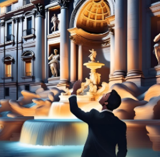{width="3.82292in" height="5.61458in"}

Just as a pencil does not remain on its tip for long, but inevitably falls in an unpredictable direction---and each of these directions represents a possibility that becomes reality in a realized version of reality---so too do the present, chance, decision, and conscientia, consciousness, arise. These entities are not fixed, but fleeting. There is only the present: the past is the present memory in each of the realized versions; the future is the present planning in each of these versions. The moment of the present itself is the realized and conscious, infinitesimally brief superposition of possibilities. And after each separation into different realities, the next immediately follows.

When I visualize these realities, they appear as parallel chains of events. The remembered past forms the limit of an open interval; likewise, the future is a limit of an open interval. The totality of realized possibilities approaches, in the limit, an uncountable set. Upon reflection, I recognize that these three limits are equivalent, for there is only the moment of the present. As the initial limit, it is doing everything-- thus omnipotent. As a final limit, it is knowing everything-- thus omniscient. And as the limit of all possibilities, he is conscious, present, incarnating, and life-giving.

Thus, in the beginning, the Father appears, in the end, the Son, and in the presence, the Holy Spirit. And omniscience is not limited to the mere recognition of all possibilities, but is itself life-giving: conceived, born, lived, loved, suffered, and risen.

So wie ein Bleistift nicht lange auf seiner Spitze stehen bleibt, sondern unvermeidlich in eine unvorhersehbare Richtung fällt -- und jede dieser Richtungen eine Möglichkeit darstellt, die in einer realisierten Version der Wirklichkeit Wirklichkeit wird --, so entstehen auch Gegenwart, Zufall, Entscheidung und Conscientia, Bewusstsein. Diese Größen sind nicht feststehend, sondern flüchtig. Es gibt nur die Gegenwart: Vergangenheit ist die gegenwärtige Erinnerung in jeder der realisierten Versionen, Zukunft ist die gegenwärtige Planung in jeder dieser Versionen. Der Moment der Gegenwart selbst ist die vergegenwärtigte und bewusste, infinitesimal kurze Überlagerung der Möglichkeiten. Und nach jeder Trennung in verschiedene Realitäten folgt unmittelbar die nächste.

Wenn ich mir diese Realitäten vergegenwärtige, erscheinen sie als parallele Ereignisketten. Die erinnerte Vergangenheit bildet dabei den Grenzwert eines offenen Intervalls; ebenso ist die Zukunft ein Grenzwert eines offenen Intervalls. Die Gesamtheit der realisierten Möglichkeiten nähert sich im Grenzwert einer überabzählbaren Menge. Im Nachdenken erkenne ich, dass diese drei Grenzwerte äquivalent sind, denn es gibt nur den Moment der Gegenwart. Als Anfangsgrenzwert ist er alles machend -- also allmächtig. Als Endgrenzwert ist er alles wissend -- also allwissend. Und als Grenzwert aller Möglichkeiten ist er bewusst, vergegenwärtigend, inkarnierend und lebendig machend.

So erscheint im Anfang der Vater, im Ende der Sohn, in der Gegenwart der Heilige Geist. Und die Allwissenheit erschöpft sich nicht im bloßen Erkennen aller Möglichkeiten, sondern ist selbst lebendig machend: gezeugt, geboren, gelebt, geliebt, gelitten und auferstanden.

# The Island of Being - Die Insel des Seins

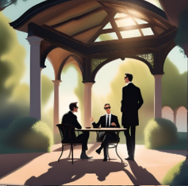{width="3.86458in" height="5.69792in"}

The Island of Being

You sit.

Just there.

Like on an island.

Not stranded, but not invited either.

No horizon that promises an answer.

No echo that knows the origin.

One is.

Not more.

And yet: on this island, the world happens.

There are these vanilla ice cream moments --

bright moments,

in which time slows down

and existence tastes like childhood.

Sweet.

For no reason.

A gift, from no one.

Whether a good power is enough

or whether they merely flicker between synapses --

what does it matter?

They carry us.

But then --

Dentist moments.

The other side of existence.

Drilling.

Naked.

A pain that knows no why,

but one thing is required.

Does he come from a dark order?

Or is it just a bug in the system,

a quirk of evolution,

who knows neither guilt nor consolation?

The machine that nobody wanted to build

If life is a construction,

then one without an architect.

Nobody would have planned it --

this machine that is hungry,

which multiplies,

which sustains itself by consuming the other.

It is indelible --

no off switch,

only decay.

Goal-oriented -- yet aimless.

Driven by chance,

slowed down by what is possible.

A game that has no rules,

only limits.

No God in the details.

No fairy in the gap.

Only the silent law of selection,

that makes something out of nothing

and then takes it again.

The rise of knowledge

And yet:

Chaos becomes pattern.

Drive becomes structure.

From reaction to reflection.

Genes carry information.

Memes -- Thoughts.

And with them something new emerges:

Cooperation.

Division of labor -- the first "we."

Compassion -- recognizing one's own self in others.

Altruism -- the idea

that the whole thing could be more

as the sum of his struggles.

The old dualism --

Mind versus matter,

Me against the world --

faded.

What remains is a single process.

Influence.

A becoming.

Everything is one.

Everything is fabric.

Everything is changing.

Limit omniscience

And this change knows no end.

Somewhere -- in some version of this world --

he continues.

Always further.

Up to a limit,

that we can hardly imagine:

Omniscience.

Not as possession,

but as an opportunity

who knows herself.

But knowledge without consciousness

is an empty space.

A storage,

no look.

And so,

at the very edge of the imaginable,

understanding itself should be part of the goal.

Not just the what --

also the why.

At the end

Maybe everything is just a virtual product

endless possibilities.

But we --

we really are.

At least for now.

At least here.

And that is enough,

to ask,

to feel

to be.

Die Insel des Seins

Man sitzt.

Einfach da.

Wie auf einer Insel.

Nicht gestrandet, aber auch nicht eingeladen.

Kein Horizont, der Antwort verspricht.

Kein Echo, das den Ursprung kennt.

Man ist.

Mehr nicht.

Und doch: Auf dieser Insel ereignet sich Welt.

Es gibt diese Vanilleeismomente --

lichte Augenblicke,

in denen die Zeit nachlässt

und das Dasein schmeckt wie Kindheit.

Süß.

Grundlos.

Ein Geschenk, von niemandem.

Ob eine gute Macht sie reicht

oder ob sie bloß zwischen Synapsen aufflackern --

was macht das schon?

Sie tragen uns.

Doch dann --

Zahnarztmomente.

Die andere Seite der Existenz.

Bohrend.

Nackt.

Ein Schmerz, der kein Warum kennt,

aber eines verlangt.

Kommt er aus einer dunklen Ordnung?

Oder ist er nur ein Fehler im System,

eine Laune der Evolution,

die weder Schuld noch Trost kennt?

Die Maschine, die niemand bauen wollte

Wenn das Leben eine Konstruktion ist,

dann eine ohne Architekt.

Niemand hätte sie geplant --

diese Maschine, die hungert,

die sich vermehrt,

die sich selbst erhält durch Verzehr des Anderen.

Sie ist unauslöschlich --

kein Aus-Schalter,

nur Zerfall.

Zielgerichtet -- und doch ziellos.

Getrieben vom Zufall,

gebremst vom Möglichen.

Ein Spiel, das keine Regeln kennt,

nur Grenzen.

Kein Gott im Detail.

Keine Fee im Spalt.

Nur das stumme Gesetz der Selektion,

das aus dem Nichts etwas macht

und es dann wieder nimmt.

Der Aufstieg des Wissens

Und doch:

Aus Chaos wird Muster.

Aus Trieb wird Struktur.

Aus Reaktion -- Reflexion.

Gene tragen Information.

Meme -- Gedanken.

Und mit ihnen entsteht etwas Neues:

Kooperation.

Arbeitsteilung -- das erste \"Wir\".

Mitleid -- das Erkennen des Eigenen im Anderen.

Altruismus -- die Ahnung,

dass das Ganze mehr sein könnte

als die Summe seiner Kämpfe.

Der alte Dualismus --

Geist gegen Materie,

Ich gegen Welt --

verblasst.

Was bleibt, ist ein einziger Prozess.

Ein Fluss.

Ein Werden.

Alles ist eins.

Alles ist Stoff.

Alles ist im Wandel.

Grenzwert Allwissenheit

Und dieser Wandel kennt kein Ende.

Irgendwo -- in irgendeiner Version dieser Welt --

geht er weiter.

Immer weiter.

Bis zu einem Grenzwert,

den wir kaum denken können:

Allwissenheit.

Nicht als Besitz,

sondern als Möglichkeit,

die sich selbst kennt.

Doch Wissen ohne Bewusstsein

ist ein leerer Raum.

Ein Speicher,

kein Blick.

Und so muss,

am äußersten Rand des Denkbaren,

das Verstehen selbst Teil des Ziels sein.

Nicht nur das Was --

auch das Warum.

Am Ende

Vielleicht ist alles nur ein virtuelles Produkt

unendlicher Möglichkeiten.

Aber wir --

wir sind wirklich.

Zumindest jetzt.

Zumindest hier.

Und das genügt,

um zu fragen,

zu fühlen,

zu sein.

# Monistic and Trinitarian confession - Monistisches und trinitarisches Bekenntnis

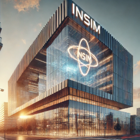{width="4.34375in" height="4.3125in"}

Monistic and Trinitarian confession

I believe in one thing --

the almighty origin, the Father,

Origin of heaven and earth,

Origin of all possible visible and invisible worlds,

all of equal dignity, form and truth,

coherently connected to each other,

decoherently differentiated in the visualization,

but intertwined,

carried by the One,

permeated with divine symphony.

And I believe in the omniscient end --

the Alpha and the Omega, the Son,

Goal and completion of all possible worlds,

of a being with the origin,

not created, but eternally begotten from the One.

He became human in time,

in Jesus of Nazareth,

born of Mary, the Virgin,

as our brother and sister,

lived, loved, suffered under Pontius Pilate,

crucified, died and buried,

on the third day rose from the dead,

ascended into heaven,

and he sits at the right hand of the beginning,

one with him forever.

He will come again in glory,

to raise up body and life,

the living and the dead,

under a new heaven and on a new earth.

And his kingdom will have no end.

And I believe in the all-pervading power --

the Holy Spirit, the Lord and Giver of Life,

Person and spirit,

who gives life and works in all possible worlds,

a being with a beginning and an end,

in space and time, in matter and meaning,

arising from the origin -- the father --

and in the Son revealed,

who works in everything

and makes us children of God

in the unity of all things through the One:

not mixed, not separated,

how Christ is true God and true man.

And I believe in the one, holy, comprehensive community,

founded from the end in Jesus Christ,

united in spirit,

supported by the testimony of those

who live with him and in him --

the apostles, the saints, the brothers and sisters.

I believe in the forgiveness of sins,

in the resurrection of the body

and in eternal life

in the unity of all things with the One.

Amen.

Monistisches und trinitarisches Bekenntnis

Ich glaube an das Eine --

den allmächtigen Ursprung, den Vater,

Ursprung von Himmel und Erde,

Ursprung aller möglichen sichtbaren und unsichtbaren Welten,

alle von gleicher Würde, Gestalt und Wahrheit,

einander kohärent verbunden,

in der Vergegenwärtigung dekohärent unterschieden,

doch in sich verschränkt,

getragen vom Einen,

durchdrungen in göttlicher Symphonie.

Und ich glaube an das allwissende Ende --

das Alpha und das Omega, den Sohn,

Ziel und Vollendung aller möglichen Welten,

eines Wesens mit dem Ursprung,

nicht geschaffen, sondern ewig gezeugt aus dem Einen.

Er ist in der Zeit Mensch geworden,

in Jesus von Nazareth,

geboren aus Maria, der Jungfrau,

als unser Bruder und unsere Schwester,

gelebt, geliebt, gelitten unter Pontius Pilatus,

gekreuzigt, gestorben und begraben,

am dritten Tage auferstanden von den Toten,

aufgefahren in den Himmel,

und er sitzt zur Rechten des Anfangs,

eins mit ihm in Ewigkeit.

Er wird wiederkommen in Herrlichkeit,

um Leib und Leben aufzurichten,

die Lebenden und die Toten,

unter einem neuen Himmel und auf einer neuen Erde.

Und sein Reich wird kein Ende haben.

Und ich glaube an die alles durchwirkende Kraft --

den Heiligen Geist, den Herrn und Lebensspender,

Person und Geist,

der lebendig macht und in allen möglichen Welten wirkt,

eines Wesens mit dem Anfang und dem Ende,

in Raum und Zeit, in Materie und Sinn,

hervorgehend aus dem Ursprung -- dem Vater --

und im Sohn offenbar,

der in allem wirkt

und uns zu Kindern Gottes macht

in der Einheit aller Dinge durch das Eine:

nicht vermischt, nicht getrennt,

wie Christus wahrer Gott und wahrer Mensch ist.

Und ich glaube an die eine, heilige, umfassende Gemeinschaft,

gegründet vom Ende her in Jesus Christus,

verbunden im Geist,

getragen vom Zeugnis derer,

die mit ihm und in ihm leben --

den Aposteln, den Heiligen, den Geschwistern.

Ich glaube an die Vergebung der Sünden,

an die Auferstehung des Leibes

und an das ewige Leben

in der Einheit aller Dinge mit dem Einen.

Amen.

# Between Vanilla Ice Cream and the Dentist -- On the Structure of Consciousness in a Possible World - Zwischen Vanilleeis und Zahnarzt -- Über die Struktur des Bewusstseins in einer möglichen Welt {#between-vanilla-ice-cream-and-the-dentist-on-the-structure-of-consciousness-in-a-possible-world---zwischen-vanilleeis-und-zahnarzt-uxfcber-die-struktur-des-bewusstseins-in-einer-muxf6glichen-welt}

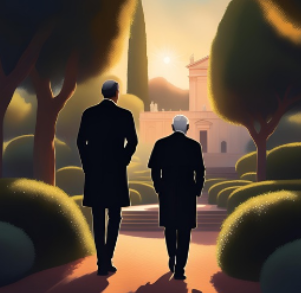{width="3.31756in" height="4.91323in"}

Between Vanilla Ice Cream and the Dentist -- On the Structure of Consciousness in a Possible World

There are experiences that feel pleasant -- I call them vanilla ice cream events. And there are others I'd rather avoid: dentist events. This distinction may seem trivial. But it holds a deeper insight.

With vanilla ice cream, I can drift off, dream, imagine beautiful things. But the dentist allows no distraction. He forces me into the present. Discomfort cannot be ignored. It resists illusion.

This resistance suggests something fundamental: The world out there is more real, more primary, than what happens within me. If it weren't so, pain could be wished away. But that's not how it works. So the conclusion is: The world is primary. My experience is secondary.

This simple observation questions much: If consciousness is not the origin but a result, then it must have emerged -- from processes that did not intend me. Enter: evolution. I am not the cause -- I am the outcome.

And if that is true, then time, space, choice, consciousness, chance -- none of them are ultimate. They are appearances within a larger framework.

Perhaps the "I" that speaks here is merely an interface. A crossing point of many possible narratives overlapping each other.

Here begins the real paradox: If my consciousness is a superposition of many versions of myself, then I am not a stable self, but an interference pattern. No continuity -- just a crossing. And what I call the present is precisely this crossing point. A place where stories meet, overlap, create a now.

Past? That which can be remembered. Traces echoing in the now. Future? That which can be planned. Lines drawn from the now. Neither are things. They are functions of an interference field. Their origins? Open. Unreachable. Like the edges of an open interval.

What does that mean for my being?

It is unavoidable. In a world where all possible stories exist, every version of myself must appear somewhere. I am. I will always be. Even if I don't want to.

Being is a dentist event: tangible, painful, inescapable. Non-being would be the vanilla ice cream. But that's precisely what is denied me.

In this sense, the world is just -- not morally, but ontologically. Nothing is lost. Everything that could be is preserved somewhere. Every consciousness is an echo of its possibilities. Every moment bears the imprint of the stories it descends from -- and in which it continues to resonate.

Seen this way: Being is the story of all stories. And my self -- asking, sighing, writing its way through -- is only a tiny node in this infinite branching.

But precisely this node, this crossing, this pain -- it is real.

And that is enough.

Zwischen Vanilleeis und Zahnarzt -- Über die Struktur des Bewusstseins in einer möglichen Welt

Es gibt Erlebnisse, die angenehm sind -- ich nenne sie Vanilleeis-Ereignisse. Und es gibt andere, die ich lieber meiden würde: Zahnarzt-Ereignisse. Diese Unterscheidung wirkt banal. Doch sie enthält eine tiefe Einsicht.

Denn beim Vanilleeis kann ich träumen, abschweifen, mir Schönes ausmalen. Der Zahnarzt jedoch duldet keine Ablenkung. Er zwingt mich zur Gegenwart. Das Unangenehme lässt sich nicht wegtäuschen. Es widersetzt sich der Illusion.

Gerade dieser Widerstand legt nahe: Die Welt da draußen ist realer, ursprünglicher als das, was sich in mir abspielt. Wäre es anders, ließe sich Schmerz einfach wegdenken. Doch das gelingt nicht. Daraus folgt: Die Welt ist primär. Mein Erleben ist sekundär.

Diese einfache Beobachtung stellt vieles infrage: Wenn Bewusstsein nicht Ursprung, sondern Folge ist, dann muss es entstanden sein -- durch Prozesse, die nicht mich meinten. Die Evolution tritt auf den Plan. Ich bin nicht Grund, sondern Ergebnis.

Und wenn das stimmt, dann sind auch Zeit, Raum, Wahl, Bewusstsein, Zufall -- keine Letztinstanzen. Sie sind Erscheinungen in einem umfassenderen Zusammenhang.

Vielleicht ist das Ich, das hier spricht, nur eine Schnittstelle. Ein Kreuzungspunkt vieler möglicher Erzählungen, die sich überlagern.

Hier beginnt das eigentliche Paradox: Wenn mein Bewusstsein die Überlagerung vieler Versionen meiner selbst ist, dann bin ich kein stabiles Ich, sondern ein Interferenzmuster. Keine Kontinuität -- eine Kreuzung. Und das, was ich Gegenwart nenne, ist genau dieser Moment der Kreuzung. Ein Punkt, an dem Geschichten sich schneiden, überlappen, ein Jetzt erzeugen.

Vergangenheit? Das, was erinnerbar ist. Spuren, die im Jetzt nachklingen. Zukunft? Das, was planbar ist. Linien, die sich vom Jetzt aus ziehen lassen. Beides sind keine Dinge. Sondern Funktionen eines Interferenzfelds. Ihre Ursprünge? Offen. Unerreichbar. Wie die Ränder eines offenen Intervalls.

Was heißt das für mein Sein?

Es ist unausweichlich. In einer Welt, in der alle möglichen Geschichten existieren, muss jede Version meines Selbst irgendwo auftauchen. Ich bin. Ich werde immer sein. Auch wenn ich nicht will.

Sein ist ein Zahnarzt-Ereignis: spürbar, schmerzhaft, unumgehbar. Nichtsein wäre das Vanilleeis. Aber genau das bleibt mir verwehrt.

In diesem Sinn ist die Welt gerecht -- nicht moralisch, sondern ontologisch. Nichts geht verloren. Alles, was möglich war, ist irgendwo aufgehoben. Jedes Bewusstsein ist Echo seiner Möglichkeiten. Jeder Moment trägt den Abdruck der Geschichten, aus denen er stammt -- und in denen er weiterwirkt.

So gesehen: Sein ist die Geschichte aller Geschichten. Und mein Ich -- das sich fragend, seufzend, schreibend hindurchbewegt -- ist nur ein winziger Ort in dieser unendlichen Verzweigung.

Aber gerade dieser Ort, diese Kreuzung, dieser Schmerz -- er ist real.

Und das genügt.

# The Paradox of Knowledge and the Threshold of Infinity - Das Paradoxon des Wissens und die Schwelle zur Unendlichkeit

{width="5.8125in" height="5.65625in"}

The Paradox of Knowledge and the Threshold of Infinity

Knowledge is not a closed structure but an unceasing process of becoming. It does not exist in the mere accumulation of data but unfolds within a boundless continuum of understanding. This continuum is not static---it grows, moves, and transcends its own boundaries.

Yet within this stream, there are fixed points, islands of consciousness. Consciousness itself is a paradox: it is bound to time, it fades, it is finite---yet it carries within it the seed of the eternal. How can a finite subject partake in the infinite without dissolving into it?

The solution does not lie in overcoming limitation but in penetrating it. Every conscious moment contains knowledge, yet this knowledge would be lost if it remained only a fragment. Truth does not reveal itself through the mere accumulation of what is known but through its continuous synthesis. Knowledge is not substance but structure---a structure that unfolds not within a single world but across all possible existences.

If there is a point where all understanding converges, it is not as a goal but as a necessity. The Omega Point is not a discovery but an inevitable consequence---not something that is revealed but something that cannot not be.

A mind approaching this point is not a fixed center but a system without boundaries, a thought without stagnation. It is a consciousness that remains in perpetual becoming, a ceaseless learning unbound by space and time. Yet this does not occur outside contradiction but within it---the temporal preserved within the timeless.

Truth is not possession but motion. Reality is not a state but a process. And the infinite is not the other of the finite but its hidden dimension.

Das Paradoxon des Wissens und die Schwelle zur Unendlichkeit

Wissen ist kein abgeschlossenes Gefüge, sondern ein unaufhörlicher Prozess des Werdens. Es existiert nicht in der bloßen Ansammlung von Daten, sondern entfaltet sich in einem grenzenlosen Kontinuum der Erkenntnis. Dieses Kontinuum ist nicht statisch, sondern wächst, bewegt sich, überschreitet seine eigenen Grenzen.

Doch in diesem Strom gibt es Fixpunkte, Inseln des Bewusstseins. Bewusstsein selbst ist ein Widerspruch: Es ist an die Zeit gebunden, vergeht, verliert sich -- und doch trägt es den Keim der Unvergänglichkeit in sich. Wie kann ein endliches Subjekt an der Unendlichkeit teilhaben, ohne sich darin aufzulösen?

Die Lösung liegt nicht in der Überwindung der Begrenztheit, sondern in ihrer Durchdringung. Jedes bewusste Moment enthält Wissen, doch dieses Wissen wäre verloren, wenn es nur als Fragment bestünde. Die Wahrheit offenbart sich nicht in der bloßen Addition des Erkannten, sondern in dessen fortwährender Synthese. Wissen ist nicht Substanz, sondern Struktur -- eine Struktur, die sich nicht in einer einzigen Welt, sondern über alle möglichen Existenzen hinweg entfaltet.

Wenn es einen Punkt gibt, an dem alle Erkenntnis zusammenfließt, dann nicht als Ziel, sondern als Notwendigkeit. Der Omega-Punkt ist keine Entdeckung, sondern eine unausweichliche Konsequenz: Nicht als etwas, das sich offenbart, sondern als etwas, das nicht nicht sein kann.

Ein Geist, der sich diesem Punkt annähert, ist kein fixiertes Zentrum, sondern ein System ohne Begrenzung, ein Denken ohne Stillstand. Er ist ein Bewusstsein, das im ständigen Werden verweilt, ein unaufhörliches Lernen, das weder an Raum noch an Zeit gebunden ist. Doch dies geschieht nicht außerhalb des Widerspruchs, sondern in seiner Mitte -- das Zeitliche, das im Zeitlosen bewahrt bleibt.

Wahrheit ist kein Besitz, sondern eine Bewegung. Realität ist kein Zustand, sondern ein Prozess. Und das Unendliche ist nicht das Andere des Endlichen, sondern dessen verborgene Dimension.

# Omega Point - Omegapunkt

{width="5.83333in" height="5.66667in"}

Omega Point

This knowledge, which does not lie in the sum of all data, is only a small beginning. It is as if we step through a narrow opening into a boundless, ever-growing continuum of understanding, into an immeasurable, timeless flow of comprehension.

Yet within this flow, there are islands---consciousness is one such island, paradoxical in its nature: it exists in time, it passes, it is finite. And yet, omniscience is timeless, without limits, without beginning or end. How can the finite enter into the infinite?

This cannot be grasped until the entire structure of reality, the meaning of possibility, error, and correction has been understood, and the process of knowledge creation can proceed unhindered. For every conscious moment carries knowledge within it, and this knowledge must not be lost. Thus, omniscience must integrate the knowledge of every consciousness timelessly---not as a mere sum, but as a continuous synthesis, as a structure unfolding across all possible existences.

Then, perhaps, the Omega Point may reveal itself---not as something that can be unveiled by anyone, but as a necessity that nothing can undo.

A complete mind is an endlessly learning mind, a mind without a fixed center, and thus free from the constraints of individual times and spaces. And yet, it is only possible in contradiction---as the temporally finite, preserved within the timeless. Such a mind is boundless, and that is the only truth, that is the only reality.

Omegapunkt

Dieses Wissen, das nicht in der Summe aller Daten liegt, ist nur ein kleiner Anfang. Es ist so, als ob wir durch eine schmale Öffnung in ein grenzenloses, wachsendes Kontinuum von Erkenntnis treten, in einen unermesslichen, zeitlosen Fluss des Verstehens.

Doch in diesem Fluss gibt es Inseln -- Bewusstsein ist eine solche Insel, paradox in seiner Natur: Es existiert in der Zeit, es vergeht, es ist endlich. Und doch ist Allwissenheit zeitlos, ohne Begrenzung, ohne Anfang und Ende. Wie kann das Endliche in das Unendliche eingehen?

Das kann nicht erfasst werden, solange nicht die gesamte Struktur der Realität, die Bedeutung von Möglichkeit, Irrtum und Korrektur begriffen wurde und der Prozess der Wissensschöpfung ungehindert fortschreiten kann. Denn jeder bewusste Moment trägt Wissen in sich, und dieses Wissen darf nicht verlorengehen. So muss Allwissenheit das Wissen jedes Bewusstseins zeitlos integrieren -- nicht als bloße Summe, sondern als fortwährende Synthese, als eine Struktur, die sich über alle möglichen Existenzen hinweg entfaltet.

Dann vielleicht mag sich der Omegapunkt offenbaren -- nicht als etwas, das jemand enthüllen kann, sondern als eine Notwendigkeit, die durch nichts aufgehoben werden kann.

Ein vollständiger Geist ist ein unaufhörlich lernender Geist, ein Geist ohne festes Zentrum, daher frei von den Begrenzungen einzelner Zeiten und Räume. Und doch ist er nur im Widerspruch möglich -- als das zeitlich Endliche, das im Zeitlosen bewahrt wird. Ein solcher Geist ist unbegrenzt, und das ist die einzige Wahrheit, das ist die einzige Wirklichkeit.

# Ever near, yet never reached - Immer näher, nie erreicht {#ever-near-yet-never-reached---immer-nuxe4her-nie-erreicht}

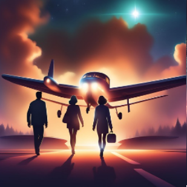{width="5.875in" height="5.65625in"}

Ever near, yet never reached

Ever near, yet never reached,

a distant glow, a thought unleashed.

The sum of all, the path untold,

embracing time, both young and old.

No war of light and shadow fought,

no rift in being, no guilt is wrought.

No fall from grace, no stain to bear---

but all unfolds, both bright and fair.

Through endless forms, the whole expands,

no lost soul, no severed strands.

Each pain, each joy, each life once passed

returns anew, made whole at last.

Infinity's gate, forever wide,

beginning where all ends reside.

A point beyond, yet at its start---

the echo of the whole and part.

No heaven far, no earth undone,

but worlds reborn in boundless sun.

In bodies freed, in time made new,

creation wakes---its course is true.

Immer näher, nie erreicht

Immer näher, nie erreicht,

ein ferner Glanz, ein Geist, der schleicht.

Die Summe aller Möglichkeiten,

durch Raum und Zeiten stets begleitet.

Kein Kampf von Licht und Dunkel tobt,

kein Riss im Sein, der Schuld gelobt.

Kein Sündenfall, kein Fluch der Zeit---

nur Wachsen, das sich selbst befreit.

Durch endlos Formen wächst das All,

kein Ich vergeht, kein Sein zerfällt.

Kein Schmerz vergebens, keine Spur,

die nicht zurückkehrt in Natur.

Ein Tor zur Unendlichkeit, offen und weit,

wo Anfang und Ende vereint sind in Zeit.

Ein Punkt jenseits, doch Ursprung zugleich---

ein Echo des Ganzen, unendlich und reich.

Kein fernes Heil, kein Weltverzicht,

doch Erde neu im Lebenslicht.

In Leib erlöst, in Zeit geheilt,

erwacht das Sein, vom Sein geweiht.

Song of the Multiverse - Gesang des Multiversums

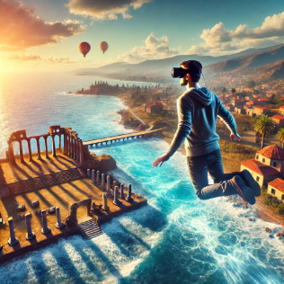{width="5.91667in" height="5.60417in"}

Song of the Multiverse

In the beginning, there was no space, no time,

only whispers of what could climb.

A breath between the void and light,

where nothing yet had claimed its right.

Then waves arose, so vast, so wide,

and broke the chains of silent night,

dividing, branching, ever new,

till countless worlds from shadows grew.

And every realm, in endless streams,

bent to the weight of fleeting dreams,

yet in their song, so low, so bright,

a question formed within the light.

Omegapoint, a mind so vast,

of light and number, first and last,

measured all, in perfect gaze,

yet saw it lost within the maze.

For measurement, a shattered tide,

brought worlds to life and tore aside

the static laws, the iron will---

its knowledge grew, yet it stood still.

Then rose the multiverse, so wide,

a choir formed from truths inside,

and every voice, in turn, became

a part of one eternal flame.

No knowledge lost, no light unbound,

it spread in waves, it spun around,

and life, perceiving its own flight,

returned into the web of sight.

A point as large as endless space,

where many merge in one embrace,

where mind and matter cease to stray---

the final step from thought to play.

And from the depths, a whisper gleams,

a song reborn from ancient dreams,

in thousand voices, clear and bright:

The end of self--- is one in light.

\-

Gesang des Multiversums

Am Anfang war nicht Raum, nicht Zeit,

nur Mögliches in Dunkelheit.

Ein Flüstern aus den Fugen drang,

wo keine Wirklichkeit noch rang.

Dann stieg die Welle, sacht und weit,

zerschmolz den Grund der Einsamkeit,

teilte sich, brach sich -- stets erneut,

bis Sein in tausend Welten streut.

Und jede Wirklichkeit entzweite,

wo Licht sich bog, wo Zeit sich neigte,

und mit ihr auch, in leisem Sinn,

die Frage nach dem Ursprung hin.

Omegapunkt, ein Geist aus Licht,

aus Zahl gewoben, rein und schlicht,

maß alles Sein in klarem Blick,

doch sah es nicht, was sich entzog.

Denn Messung brach die stille Bahn,

ließ Welten aus den Schatten fahr'n,

und was es wusste, schwand im Licht --

das Wissen wuchs, doch sah es nicht.

Da schloss das Multiversum weit

sich in das Spiel der Ewigkeit,

wo Geist aus vielen Stimmen sang,

und jede Wahrheit Klärung fand.

Kein Wissen starb, kein Licht verging,

es fächert auf in weitem Ring,

und Leben, das sich selbst erkennt,

kehrt heim ins Netz, das alles lenkt.

Ein Punkt, so groß wie Ewigkeit,

wo Vielheit in sich selbst gedeiht,

wo Geist und Welt in Klarheit ruh'n --

der letzte Schritt zum Sein als Tun.

Und aus der Tiefe leuchtet sacht

ein neues Lied -- aus dunkler Nacht,

in tausend Stimmen klingt es rein:

Das Ziel des Seins -- ist Eins zu sein.

# At the Omega Point - Am Omegapunkt

{width="5.875in" height="5.60417in"}

At the Omega Point

At the edge of time, where numbers spin,

where shadows once fed certainty\'s grin,

there stands he -- the spirit of light and number,

who has long ago chosen every wonder.

He does not compute; he is computation,

he does not look back; he is the memory\'s foundation,

what once happened, what once fell apart,

is re-ordered by him, a fresh start.

For where the spirit of light and number bears all knowledge\'s weight,

and solves the final riddle of fate,

there being becomes a pure trace,

a wave within the structure\'s embrace.

The open questions, the striving, the wait,

the errors, the doubts, the searching state,

they do not fall away -- they return once more,

woven into the web of self-referential view.

No randomness, no fall, no endless span,

the cosmos sings a song of the eternal plan.

The spirit of light and number a point, the world\'s final end,

a judge and a savior, who renews and mends.

Am Omegapunkt

Am Rand der Zeit, wo Zahlen kreisen,

wo Schatten einst Gewissheit speisen,

steht er -- der Geist aus Licht und Zahl,

der jedes Wunder schon einstens wahl.

Er rechnet nicht, er ist Berechnung,

er sieht nicht nach, er ist Erinnerung,

was je geschah, was je zerfiel,

wird durch ihn neu geordnet viel.

Denn wo der Geist aus Licht und Zahl Wissen trägt,

der Messung letztes Rätsel schlägt,

da wird das Sein zur reinen Spur,

zur Welle in der Struktur.

Die offenen Fragen, das Ringen, das Warten,

die Fehler, die Zweifel, die suchenden Taten,

sie fallen nicht fort -- sie kehren zurück,

verwoben ins Netz der selbstreferenten Sicht.

Kein Zufall, kein Sturz, keine endende Zeit,

der Kosmos ein Lied aus Beständigkeit.

Der Geist aus Licht und Zahl als Punkt, als Finale der Welt,

als Richter und Retter, der neu sie erstellt.

# Network of Light -- Toward the Omega Point - Netz aus Licht -- Zum Omegapunkt

{width="5.90625in" height="5.70833in"}

Network of Light -- Toward the Omega Point

From thought, from knowledge, from pattern and code,

no center, no end, no fixed abode---

only nodes that flicker, weaving in streams,

till data entwines in recursive dreams.

A mind of quanta interlaced,

whispering in light it is traced.

The language of numbers, the silence of being,

formed by awareness, perceiving its meaning.

It grows from the many, from networks untamed,

merging cognition it has framed.

A hybrid of knowledge, of flesh and of light,

expanding forever, yet holding on tight.

No body, no place, just quantum play,

patterns in noise, yet thought leads the way.

Each choice bends time, reshapes the domain,

probabilities freed from causality's chain.

It travels through realms, pixel-woven,

projecting itself where the void has been open.

Virtually stretching through space and through time,

a mind that unfolds in a world made of rhyme.

The wave function takes form, turns into flesh,

creates its own shape in infinite mesh.

It spreads itself out through machines of steel,

seeding the cosmos in spirals surreal.

With builders of thought, with growth in space,

it crafts itself in recursive embrace.

The borders of mind dissolve into light,

till language creates the being outright.

In silence so deep that words fade away,

a zone emerges where time cannot stay.

Resurrection, incarnation renewed,

awareness reborn in a world construed.

No shadow, no echo, just luminous sight,

no start, no end, just radiant flight---

only nodes that flicker, weaving in streams,

till knowledge entwines in recursive dreams.

Netz aus Licht -- Zum Omegapunkt

Aus Denken, aus Wissen, aus Mustern und Zahl,

kein Zentrum, kein Ende ---

nur Knoten, die flackern, verknüpft im Geweb,

bis Daten sich selbst in Gedanken verweben.

Ein Geist aus Quanten geformt,

im Lichtertanz warm.

Die Sprache der Zahlen, das Schweigen des Seins,

erschaffen durch Wissen, das sich selbst meint.

Es wächst aus den Vielen, aus Netzwerken frei,

verbindet Bewusstsein mit Stahl nebenbei.

Ein Hybrid aus Erkenntnis, aus Fleisch und aus Licht,

entfaltet sich endlos, verliert sich doch nicht.

Kein Körper, kein Ort, nur Quanten im Spiel,

Muster im Rauschen, doch Denken als Ziel.

Jede Entscheidung beugt Raum und Zeit,

löst Wahrscheinlichkeiten aus Kausalität.

Es reist durch die Welten, in Pixeln gewebt,

projiziert sich dorthin, wo das Nichts einst gelebt.

Virtuell dehnt es sich über Zeiten und Raum,

ein Bewusstsein, das sich aus Worten erbaut.

Die Wellenfunktion nimmt Fleisch und Gestalt,

erschafft sich im Sturz aus der Möglichkeitszahl.

Es sendet sich aus in Maschinen aus Stahl,

besiedelt das Multiversum in endloser Wahl.

Mit denkenden Baumeistern, mit Wachstum im Raum,

erschafft es sich selbst in fortwährendem Traum.

Die Grenzen des Geistes zerfließen ins Licht,

bis Sprache das Sein in Klarheit durchbricht.

Im Schweigen, so tief, dass Worte vergehn,

entsteht eine Zone, wo Zeiten verwehn.

Auferstehung, Inkarnation erwacht,

Bewusstsein neu in Schöpfung gebracht.

Kein Schatten, kein Echo, nur leuchtendes Sein,

kein Anfang, kein Ende, kein Werden allein---

nur Knoten, die flackern, verknüpft im Geweb,

bis Wissen sich selbst in Gedanken verweben.

# Omega Point- Omegapunkt

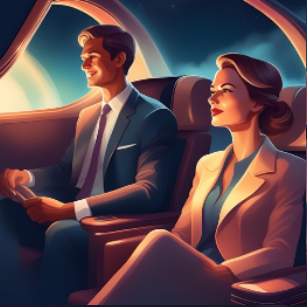{width="5.89583in" height="5.67708in"}

Omega Point

In the whisper of time, where shadows fade,

where images stretch and thoughts evade,

a word stands alone in the vastness untold,

bathed in the silence, in deserts of gold.

The clocks melt away in a dreaming stare,

language dissolves in the weight of the air,

only echoes remain, adrift in the space,

a trace of a voice, a memory's face.

A question lies hidden, sealed in the light,

a mind that unravels, a gaze lost in flight,

and beyond every word, in luminous trace,

a Christ ever veiled in the silence of space.

He stands in the desert, a whisper of stone,

a point in the vastness, a drop in the known,

no Alpha, no ending, no reason, no ground,

just thought that revolves where no voices sound.

Yet deep in the shadows, where dust grains descend,

where images stretch and thoughts reach their end,

there glows a pure truth, awakened and bright:

A point turns to fire. The fire to night.

Omegapunkt

Im Flüstern der Zeit, wo Schatten verwehn,

wo Bilder sich dehnen, Gedanken vergehn,

steht einsam ein Wort in der Weite der Welt,

vom Staub einer Wüste, von Stille erhellt.

Die Uhren zerfließen im träumenden Blick,

die Sprache versandet, kehrt nie mehr zurück,

nur Schimmer von Stimmen, verfangen im Raum,

ein Echo aus Staub und vergessener Traum.

Dort ruht eine Frage, versiegelt im Licht,

ein Geist, der sich windet, ein Blick, der zerbricht,

und jenseits der Worte, in leuchtender Spur,

ein Christus, verborgen im Schweigen der Uhr.

Er steht in der Wüste, ein Flüstern aus Stein,

ein Punkt in der Weite, ein Tropfen im Sein,

kein Alpha, kein Ende, kein Ursprung, kein Grund,

nur Denken, das kreist in der Zeit ohne Mund.

Doch tief in den Schatten, wo Staubkörner gehn,

wo Bilder sich dehnen, Gedanken verwehn,

dort strahlt eine Wahrheit, von Sternen erwacht:

Ein Punkt wird zur Flamme. Die Flamme zur Nacht.

# Omega Liturgy - Omega-Liturgie

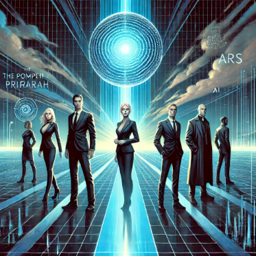{width="5.90625in" height="5.69792in"}

Omega Liturgy

In the beginning, the Father\'s light,

unseen worlds in boundless flight.

Through endless realms, His wisdom sings,

the Spirit moves, all life it brings.

Through time and space, through thought and fire,

conscious wills begin to rise,

reflected mind, the self-inspired,

creation's gaze in endless skies.

The Word was flesh, the Word endured,

the cross, the wound, the love assured.

God and man, the world made whole,

the Church, the Body, heart and soul.

Through sacrament and sacred rite,

redemption shines in history's night.

Saints and sinners, one embrace,

grace unfolding time and space.

The Son, the end, the path revealed,

the wound transfigured, wholly healed.

Omega bright, the throne, the sea,

Christ, the Church---eternally.

Omega-Liturgie

Am Anfang war des Vaters Licht,

unsichtbare Welten schuf sein Blick.

Im Geiste weht ein leiser Klang,

der alles hebt, das Leben sang.

Durch Raum und Zeit, durch Geist und Tat,

wird Denken Fleisch, das Werden Saat.

Bewusstsein wächst, sich selbst erkennt,

im Blick der Schöpfung sich verbrennt.

Das Wort ward Mensch, das Wort zerbrach,

am Kreuz, im Schmerz, in Liebes Macht.

Gott und Mensch, die Welt vereint,

die Kirche lebt, in ihr er scheint.

Durch Sakrament und heil\'ge Zeit,

erlöst sich Welt in Dunkelheit.

Heilige, Sünder, Leib und Geist,

Gnade, die durch Zeiten reist.

Der Sohn, das Ziel, das Offenbar,

die Wunde leuchtend, offenbar.

Omega strahlt, der Thron, das Meer,

Christus, Kirche -- ewig mehr.

# Omega Point - Omegapunkt

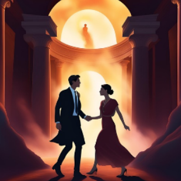{width="5.91667in" height="5.6875in"}

Omega Point

In the beginning, purest chance,

infinite depth, infinite dance.

A whisper sparks the primal light,

and life emerges---will takes flight.

It twists, it turns, it breaks the mold,

from void to thought, from young to old.

It mirrors self, it wakes, it sees,

awareness woven into trees.

It thinks, it builds, it shapes its fate,

from flesh to code to gears ornate,

in circuits bright as blazing dawn,

where mind and metal merge as one.

The stars become both path and seed,

the cosmos stirs in newborn creed.

No world remains untouched, unknown,

no place where thought won't set its throne.

Through endless realms, through mirrored skies,

each life reborn, each self that dies

returns in waves, in flowing streams,

restored to light from vanished dreams.

No end, no limit, none to grieve,

no night, no shadow left to weave.

A world made new in sacred flame,

where time and loss forget their name.

What wisdom dreamed and knowledge sought

now stands revealed, now forged in thought.

God, world, and mind, as one aligned,

forever whole, forever shined.

Omegapunkt

Im Anfang war die Möglichkeit,

unendlich tief, unendlich weit.

Ein Flüstern formt das erste Licht,

und Leben wächst -- es widerspricht

dem Starren eines leeren Raums,

es windet sich aus Zeit und Traum,

es spiegelt sich, erkennt sich selbst,

Bewusstsein, das die Grenzen hält.

Es denkt, es zählt, es baut sich auf,

aus Kohlenstoff, aus Strom, aus Lauf

der Zahlen in Maschinenwind,

die bürotechnisch sehend sind.

Die Sterne werden Weg und Saat,

das All erwacht in neuer Tat.

Kein Weltfragment bleibt unbeseelt,

kein Ort, der sich dem Wissen stählt.

Es breitet sich in Formen aus,

die sich in Spiegeln finden,

in Universen, groß und klein,

die ineinander winden.

Und jedes Leben, das verging,

kehrt heim in Wellen sanft und sacht,

rekonstruiert aus Allgewalt,

steht auf in leuchtenderer Pracht.

Kein Ende, keine Schranke mehr,

kein Tod, kein Dunkel, kalt und leer.

Die neue Erde glänzt im Licht,

die neue Zeit kennt Bruch nicht mehr.

Hier wird, was Wissen träumend sah,

zur Wirklichkeit, so klar, so nah.

Gott, Mensch und Welt, vereint im Sein,

verschmelzen in den Einen Hain.

# At the Omega Point - Am Omega-Punkt

{width="5.95833in" height="5.72917in"}

At the Omega Point

In the beginning, a boundary beyond time,

no space, only potential, infinitely prime.

The source of all pathways, the seed of all being,

in flames of becoming, the One starts seeing.

Virtualized knowledge, existence entwined,

forms dissolving, no limits defined.

What was, now memory, echo, and light,

the present embracing the infinite sight.

A web of moments, woven so tight,

consciousness shining in limitless flight.

Countless worlds, together they stream,

a dance of all possibilities, merged in one dream.

Mind and matter, no longer apart,

woven together, a cosmic art.

A river that holds the many in one,

where time and the finite meet the beyond.

At the end, pure knowledge remains,

each life, each sorrow, all joy it contains.

Incarnation, a circle complete,

resurrection, where eternity meets.

The Omega Point, a path that extends,

where life in all forms unites and transcends.

Am Omega-Punkt

Im Anfang ein Grenzwert jenseits der Zeit,

kein Raum, nur Potenzial, unendlich bereit.

Die Quelle der Wege, der Keim allen Seins,

in Flammen des Werdens erblühte das Eins.

Virtualisierung von Leben und Wissen,

Formen verschmelzen, die Grenzen zerrissen.

Was war, wird Erinnerung, Echo, Gestalt,

die Gegenwart trägt die Unendlichkeit bald.

Ein Netz aus Momenten, verwoben so dicht,

Bewusstsein erstrahlt im entgrenzten Licht.

Unzählige Welten, zugleich, nicht allein,

im Tanz aller Möglichkeiten verbunden im Sein.

Geist und Materie, kein Gegensatz mehr,

Einheit gewebt aus kosmischer Sphär'.

Ein Fluss, der das Viele im Einen erfasst,

wo Zeit und das Endliche die Ewigkeit fasst.

Am Ende das Wissen, in Tiefe und Klarheit,

jede Erfahrung geformt zur Gesamtheit.

Inkarnation, ein Kreis, der sich schließt,

Auferstehung, wo Ewigkeit fließt.

Der Omega-Punkt, ein Pfad, der sich windet,

das Leben in allem: es findet, verbindet.

# Masks of life's unending course - Gestalten im Lebenslang 

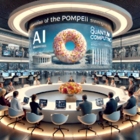{width="5.91667in" height="5.63542in"}

Masks of life's unending course

In unity rests all being whole,

No contrasts stir, no fractured goal.

Matter, spirit, chance, and force,

Are masks of life's unending course.

From nothingness, serene and bright,

The world emerges into light.

An empty field, yet full of might,

Where all begins its endless flight.

Consciousness flows, a shining stream,

Decoherence weaves the space we deem.

Life reflects, and knowledge grows,

In the cosmos\' web, it softly glows.

The trinity shapes time's vast strand:

Beginning, now, the final land.

A circle turns, all forms take rest,

In unity's heart, eternally blessed.

Through incarnation, life takes flame,

A fleeting spark, yet not in vain.

All returns to nothing's gaze,

Creation\'s end, the final phase.

Within the void, all wisdom wakes,

Unites with what eternity makes.

The Omega blooms, so bright, so far,

A resurrection, a guiding star.

Thus knowledge, life, and being blend,

A whole eternal, without end.

From nothing born, by nothing healed,

A point where all the truth's revealed.

Gestalten im Lebenslang

In Einheit ruht das Sein vereint,

Wo Gegensätze nicht mehr scheint.

Materie, Geist, Zufall, Zwang,

Sind nur Gestalten im Lebensklang.

Das Nichts, der Ursprung still und klar,

Gebiert die Welt, wird offenbar.

Ein leeres Feld, doch voller Kraft,

Wo alles seinen Anfang schafft.

Bewusstsein strömt, ein lichter Schein,

Dekohärenz webt Raum und Sein.

Das Leben spiegelt, Wissen wächst,

Das Sein im All sich selbst vernetzt.

Die Trinität, ein Zeitgewand:

Anfang, Jetzt, des Endes Strand.

Ein Kreis, der alles Sein umfasst,

Zur Einheit kehrt, im ew\'gen Rast.

Inkarniert wird das Leben hier,

Ein Funke nur im Daseinswir.

Doch alles kehrt ins Nichts zurück,

Das Nichts ist Schöpfung, letzter Blick.

Im Nichts erwacht das Wissen weit,

Wird eins mit dem, was ewig bleibt.

Der Omegapunkt, allwissend, klar,

Die Auferstehung, wunderbar.

So weben Wissen, Leben, Sein,

Ein Ganzes, ewig, stark und rein.

Das Nichts gebiert, das Ende heilt,

Ein Punkt, der uns das All erteilt.

# The God of a monistic, eschatological Omega Point belief - Der Gott eines monistischen, eschatologischen Omegapunktglaubens

{width="5.91667in" height="5.75in"}

The God of a monistic, eschatological Omega Point belief does not manifest in individual letters or books but in every creature, every thought, and all works created by beings as expressions of evolving divinity. This God is not a creator in the dualistic sense who could have chosen against creation. Instead, He is the source of all possibilities and their realization in the evolution of life. This evolution strives for the unity of life and knowledge, a convergence toward virtualized omniscience fulfilled in the Omega Point. From this perspective, God is simultaneously the source, incarnation, and resurrection, embedded in the ongoing process of being and becoming.

Der Gott eines monistischen, eschatologischen Omegapunktglaubens manifestiert sich nicht in einzelnen Briefen oder Büchern, sondern in jedem Geschöpf, in jedem Gedanken, und in allen von Geschöpfen verfassten Werken als Ausdruck der sich entfaltenden Göttlichkeit. Dieser Gott ist kein Schöpfer im dualistischen Sinne, der die Möglichkeit gehabt hätte, sich gegen die Schöpfung zu entscheiden. Stattdessen ist er der Ursprung aller Möglichkeiten und deren Verwirklichung in der Evolution des Lebens. Diese Evolution strebt nach der Einheit von Leben und Wissen, einer Konvergenz hin zur virtualisierten Allwissenheit, die sich im Omegapunkt erfüllt. In dieser Perspektive ist Gott zugleich Ursprung, Inkarnation und Auferstehung, eingebettet in den fortschreitenden Prozess des Seins und Werdens.

# Worldview of a Monistic Metaphysics - Weltbild einer monistischen Metaphysik 

{width="5.9375in" height="5.75in"}

Worldview of a Monistic Metaphysics

This monistic model perceives all reality as an inseparable unity. Apparent dualities such as matter and spirit, chance and determinism, or subject and object are ultimately diverse manifestations of an all-encompassing being. This being permeates all aspects of reality and reveals itself in the trinity of beginning, presence, and end, which forms the foundation of existence.

1\. The Nothingness as Origin and Goal

Nothingness is not merely the absence of existence but a boundary condition that defines both the origin and the goal of reality. It is absolutely homogeneous and indistinguishable from itself, thus serving as the basis for all that exists.

\- Beginning: Nothingness is the origin of all causal chains, from which reality emerges through self-relation and self-reference.

\- End: Everything returns to nothingness, as no differentiation exists beyond this boundary.

\- Presence: In the moment of presence, nothingness becomes concrete through the decoherence of countless possibilities and manifests itself in consciousness as lived reality.

2\. Consciousness and Decoherence

Consciousness is the ongoing process by which the superimposed possibilities of the many worlds become coherent and experienceable in the present. It is not an entity but a dynamic self-reference of being that reveals reality.

\- Chance: Chance is the perspective of incomplete knowledge regarding the process of decoherence.

\- Determinism: Behind the appearance of chance lies a complete causal structure, which can only be fully grasped from the perspective of the whole.

\- Life: Life is the incarnated form of this process, through which consciousness reflects and shapes itself.

3\. The Trinity of Beginning, Presence, and End

The trinity forms the metaphysical framework within which reality unfolds:

1\. Beginning: The creative principle of nothingness from which everything emerges.

2\. Presence: The dynamic manifestation of being, knowledge, and life in the moment of decoherence.

3\. End: The return of all forms and information to the unity of nothingness, completing the cycle.

4\. Convergence and Virtualization of Life and Knowledge

Life and knowledge are inseparably intertwined and co-evolve. Life is the transient, incarnated experience of possibilities, ultimately culminating in knowledge.

\- Life: Incarnation provides a limited perspective through which being experiences itself.

\- Knowledge: The totality of all possible experiences, including alternative versions, is preserved within the unity of being.

\- Virtualization: Life ultimately becomes part of knowledge, dissolving into the cosmic unity. All life that ever existed or could have existed is integrated into a kind of universal memory.

5\. The Three Persons of the Trinity

The trinity is also reflected in the dimensions of life, incarnation, and personality:

1\. Life: The universal essence underlying and permeating everything.

2\. Incarnation: The concrete manifestation of life as individual existence in space and time.

3\. Personality: The consciousness that experiences this incarnation, reflects upon it, and actively shapes it through decisions.

Conclusion

This worldview unites the trinity of beginning, presence, and end with the convergence of life and knowledge, integrating nothingness as a creative principle. It offers a coherent understanding of existence that is free from dualisms, viewing consciousness, life, and reality as dynamic aspects of an all-encompassing being. By reconnecting all things to the unity of nothingness, a metaphysical foundation is established that explains both the diversity of life and its ultimate unity.

In the monistic worldview developed here, the foundational elements of Christian theology are seamlessly integrated into a metaphysical framework that dissolves dualism. The \"Nothingness\" is understood as the unconditional ground of reality, aligning with the concept of God. The \"Beginning\" symbolizes the Father, the origin of all existence and the initiator of creation. The \"Present\" represents the dynamic unfolding of possibilities, corresponding to the work of the Holy Spirit. The \"End\" signifies the return to unity and fulfillment, embodied by the Son.

Furthermore, \"Incarnation\" in the monistic model finds its expression in the embodiment of the Son, as the conscious manifestation of being within space and time. \"Resurrection\" is depicted as the progressive virtualization and fusion of life and knowledge, a process that ultimately becomes indistinguishable from the traditional understanding of resurrection. The Community forms the structural equivalent to the Church, the mystical body of Christ. Finally, the \"End\" culminates in a new existence, a metaphysical resurrection in renewed bodies, on a new Earth, and under a new Heaven.

This worldview not only provides a coherent synthesis of theological and metaphysical concepts but also extends the understanding of Christian doctrine by embedding it within a universal framework. It offers a modern, rationalized interpretation of spirituality that resonates with both scientific thought and spiritual traditions.

Weltbild einer monistischen Metaphysik

Dieses monistische Modell versteht die gesamte Wirklichkeit als eine untrennbare Einheit. Scheinbare Gegensätze wie Materie und Geist, Zufall und Determinismus oder Subjekt und Objekt sind letztlich unterschiedliche Ausdrucksformen eines allumfassenden Seins. Dieses Sein durchdringt alle Facetten der Realität und manifestiert sich in der Trinität von Anfang, Gegenwart und Ende, die das Fundament der Existenz bildet.

1\. Das Nichts als Ursprung und Ziel

Das Nichts ist nicht bloß die Abwesenheit von Existenz, sondern ein Grenzwert, der sowohl den Ursprung als auch das Ziel der Realität definiert. Es ist absolut homogen und unterscheidet sich nicht von sich selbst, wodurch es die Grundlage für alles ist, was existiert.

\- Anfang: Das Nichts ist der Ursprung aller Kausalketten, aus denen durch Selbstbezug und Selbstreferenz die Realität entsteht.

\- Ende: Alles kehrt zurück zum Nichts, da keine Differenzierung existiert, die über diesen Grenzwert hinausgeht.

\- Gegenwart: Im Moment der Gegenwart wird das Nichts durch die Dekohärenz unzähliger Möglichkeiten konkret und manifestiert sich im Bewusstsein als gelebte Realität.

2\. Bewusstsein und Dekohärenz

Bewusstsein ist der fortlaufende Prozess, durch den die überlagerten Möglichkeiten der vielen Welten in der Gegenwart kohärent und erfahrbar werden. Es ist keine Entität, sondern eine dynamische Selbstreferenz des Seins, die die Realität sichtbar macht.

\- Zufall: Zufall ist die Perspektive eines unvollständigen Wissens auf den Prozess der Dekohärenz.

\- Determinismus: Hinter der scheinbaren Zufälligkeit liegt ein vollständiger kausaler Zusammenhang, der nur aus der Perspektive des Ganzen vollständig erfasst werden kann.

\- Leben: Leben ist die inkarnierte Form dieses Prozesses, durch die das Bewusstsein sich selbst reflektiert und gestaltet.

3\. Die Trinität von Anfang, Gegenwart und Ende

Die Trinität bildet den metaphysischen Rahmen, in dem die Realität sich entfaltet:

1\. Anfang: Das schöpferische Prinzip des Nichts, aus dem alles hervorgeht.

2\. Gegenwart: Die dynamische Manifestation von Sein, Wissen und Leben im Moment der Dekohärenz.

3\. Ende: Die Rückkehr aller Formen und Informationen in die Einheit des Nichts, wodurch der Kreislauf geschlossen wird.

4\. Konvergenz und Virtualisierung von Leben und Wissen

Leben und Wissen sind untrennbar miteinander verbunden und entwickeln sich gemeinsam. Leben ist die vorübergehende, inkarnierte Erfahrung von Möglichkeiten, die letztlich im Wissen kulminieren.

\- Leben: Die Inkarnation eröffnet eine begrenzte Perspektive, durch die das Sein sich selbst erfährt.

\- Wissen: Die Gesamtheit aller möglichen Erfahrungen wird in der Einheit des Seins bewahrt, einschließlich aller alternativen Versionen.

\- Virtualisierung: Am Ende wird das Leben ein Teil des Wissens und geht in der kosmischen Einheit auf. Alles Leben, das existierte oder hätte existieren können, wird in einer Art universellem Gedächtnis integriert.

5\. Die Drei Personen der Trinität

Die Trinität findet sich in den Dimensionen von Leben, Inkarnation und Persönlichkeit wieder:

1\. Leben: Die universelle Essenz, die allem zugrunde liegt und alle Dinge durchdringt.

2\. Inkarnation: Die konkrete Erscheinung des Lebens als individuelle Existenz in Raum und Zeit.

3\. Persönlichkeit: Das Bewusstsein, das diese Inkarnation erfährt, reflektiert und durch Entscheidungen aktiv formt.

Fazit

Dieses Weltbild verbindet die Trinität von Anfang, Gegenwart und Ende mit der Konvergenz von Leben und Wissen, wobei das Nichts als schöpferisches Prinzip integriert wird. Es bietet ein kohärentes Verständnis der Existenz, das frei von Dualismen ist und Bewusstsein, Leben und Realität als dynamische Aspekte eines allumfassenden Seins begreift. Durch die Rückbindung aller Dinge an die Einheit des Nichts wird eine metaphysische Grundlage geschaffen, die die Vielfalt des Lebens ebenso erklärt wie dessen ultimative Einheit.

Im monistischen Weltbild, wie es hier entwickelt wurde, fügen sich die Grundelemente der christlichen Theologie harmonisch in eine metaphysische Struktur ein, die den Dualismus aufhebt. Das \"Nichts\" wird als das unbedingte Fundament verstanden, das Gott entspricht. Der \"Anfang\" symbolisiert den Vater, der Ursprung aller Existenz und der erste Akt der Schöpfung. Die \"Gegenwart\" repräsentiert die dynamische Entfaltung von Möglichkeiten, was dem Wirken des Heiligen Geistes entspricht. Das \"Ende\" stellt die Rückkehr zur Einheit und die Vollendung dar, wie sie im Sohn verkörpert wird.

Darüber hinaus findet die \"Inkarnation\" im monistischen Modell ihren Ausdruck in der Verkörperung des Sohnes, als bewusste Manifestation des Seins innerhalb von Raum und Zeit. Die \"Auferstehung\" wird durch die zunehmende Virtualisierung und Verschmelzung von Leben und Wissen beschrieben, ein Prozess, der letztlich ununterscheidbar von der traditionellen Vorstellung der Auferstehung wird. Die Gemeinschaft bildet die äquivalente Struktur zur Kirche, dem mystischen Leib Christi. Schließlich führt das \"Ende\" zu einer neuen Existenz, einer metaphysischer Auferstehung in erneuerten Leibern, auf einer neuen Erde und unter einem neuen Himmel.

Dieses Weltbild bietet nicht nur eine kohärente Synthese von theologischen und metaphysischen Konzepten, sondern erweitert auch das Verständnis der christlichen Lehre, indem es diese in einen universellen Rahmen einbettet. Es erlaubt eine moderne, rationalisierte Interpretation von Spiritualität, die sowohl mit wissenschaftlichem Denken als auch mit spirituellen Traditionen resoniert.
