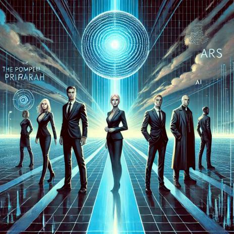

# Projekt_Pompeji

  

# The Last Freedom – A Dystopian Science Fiction Trilogy

Welcome to the official repository of the trilogy **"The Last Freedom"** by Paul Koop. This collection of three works combines philosophical reflections, technological visions, and human conflicts in a dystopian setting. It serves as a foundation for creative adaptations, continuations, or interpretations.

## Overview of the Trilogy

### 1. **The Pompeii Project**
This first installment explores the simulation of ancient Pompeii by an AI-driven corporation. It delves into the philosophical and moral consequences of quantum computing and the interaction between humans and technology.

**Review:** This work offers an original blend of technology and theology, though it has minor shortcomings in character development and pacing.

### 2. **I.R.A.R.A.H. Responds**
The sequel delves deeper into the moral dilemmas arising from interactions with AI. The protagonists navigate a complex web of escape, technological challenges, and ideological conflicts.

**Review:** A compelling continuation with strong societal relevance. Its depiction of surveillance and escape stands out, though some supporting characters lack depth.

### 3. **The Last Freedom**
The trilogy’s conclusion poses the ultimate question of whether human freedom is possible in a fully surveilled society. The reactivation of the AI ARS brings philosophical and emotional conflicts to a climax.

**Review:** A strong finale distinguished by depth and societal relevance. Despite minor pacing issues, it remains an outstanding read.

## Potential Uses

These works offer a rich foundation for creative adaptations:

- **Audio Drama or Audiobook:** The dialogue-driven scenes and atmospheric language lend themselves well to an auditory format.
- **Stage Adaptation:** The philosophical conflicts and interpersonal dynamics could be intensified on stage.
- **Film Interpretation:** The dystopian setting, technological visions, and dynamic plot invite cinematic exploration.
- **Follow-Up Novels:** The open endings and profound themes provide room for successors to expand the narrative.

## Repository Structure

- Contains the manuscript of *The Pompeii Project*.
- Contains the manuscript of *I.R.A.R.A.H. Responds*.
- Contains the manuscript of *The Last Freedom*.

# Die letzte Freiheit – Eine dystopische Science-Fiction-Trilogie

Willkommen zum offiziellen Repository der Trilogie **"Die letzte Freiheit"** von Paul Koop. Diese drei Werke kombinieren philosophische Reflexionen, technologische Visionen und menschliche Konflikte in einer dystopischen Welt. Sie bieten eine Grundlage für kreative Weiterentwicklungen, Adaptionen und Interpretationen.

## Überblick über die Trilogie

### 1. **Das Pompeji-Projekt**
In diesem Auftaktband wird die Simulation der antiken Stadt Pompeji durch ein KI-Unternehmen thematisiert. Das Werk untersucht die philosophischen und moralischen Konsequenzen von Quantencomputing und der Interaktion zwischen Mensch und Technologie. 

**Rezension:** Dieses Werk bietet eine originelle Verbindung zwischen Technologie und Theologie, weist jedoch leichte Schwächen in der Figurenentwicklung und im Tempo auf.

### 2. **I.R.A.R.A.H. antwortet**
Die Fortsetzung taucht tiefer in die moralischen Dilemmas ein, die durch die Interaktion mit der KI entstehen. Die Hauptfiguren finden sich in einem komplexen Netz aus Flucht, technologischen Abenteuern und ideologischen Konflikten wieder.

**Rezension:** Eine spannende Weiterführung mit starker gesellschaftlicher Relevanz. Besonders die Darstellung von Flucht und Überwachung besticht, während einige Nebenfiguren blass bleiben.

### 3. **Die letzte Freiheit**
Der Abschluss der Trilogie stellt die ultimative Frage nach der Möglichkeit menschlicher Freiheit in einer totalüberwachten Gesellschaft. Die Reaktivierung der KI ARS bringt philosophische und emotionale Konflikte auf den Höhepunkt.

**Rezension:** Ein gelungener Abschluss, der durch Tiefe und gesellschaftliche Aktualität besticht. Trotz kleiner Schwächen im Tempo bleibt der Roman eine herausragende Lektüre.

## Nutzungsmöglichkeiten

Diese Werke bieten eine reichhaltige Grundlage für kreative Adaptionen:

- **Hörspiel oder Hörbuch:** Die dialogreichen Szenen und die atmosphärische Sprache eignen sich ideal für eine akustische Umsetzung.
- **Bühnenadaption:** Die philosophischen Konflikte und zwischenmenschlichen Beziehungen könnten auf der Bühne intensiviert werden.
- **Filmische Interpretation:** Die dystopische Welt, die technologischen Visionen und die spannungsreiche Handlung laden zu einer filmischen Umsetzung ein.
- **Fortsetzungsromane:** Die offenen Enden und tiefen Themen bieten Raum für Nachfolger, die die Geschichte weiterentwickeln.

## Struktur des Repositories

- Enthält das Manuskript von *Das Pompeji-Projekt*.
- Enthält das Manuskript von *I.R.A.R.A.H. antwortet*.
- Enthält das Manuskript von *Die letzte Freiheit*.
