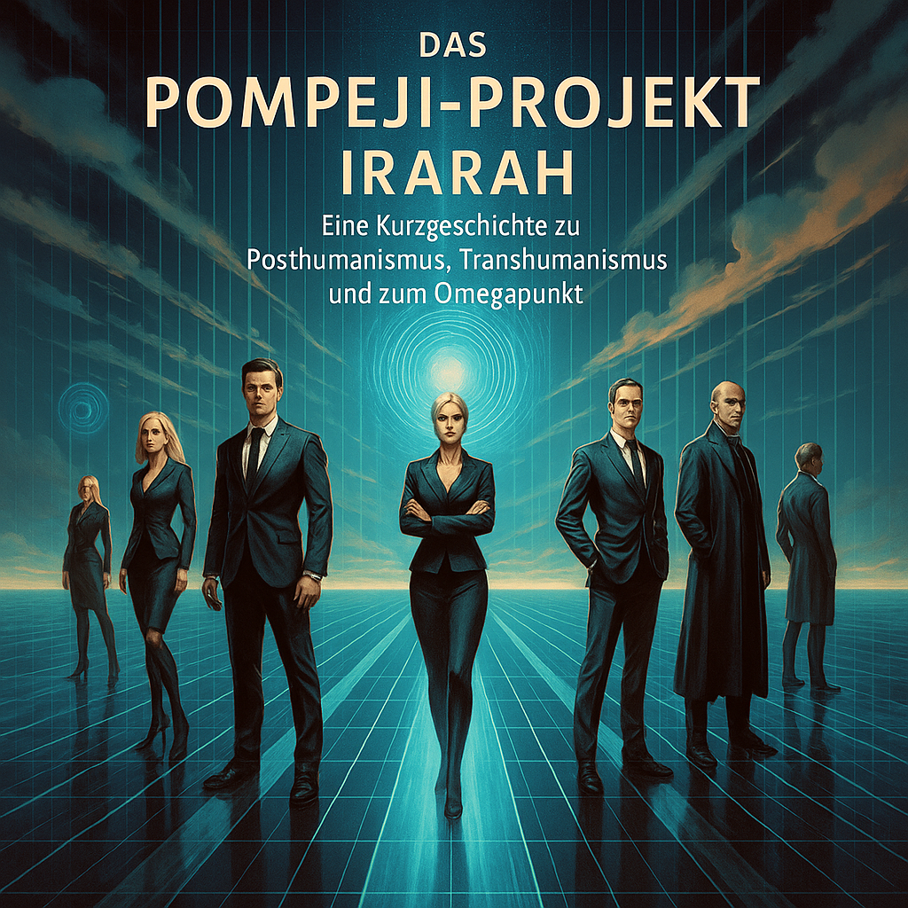

# Projekt_Pompeji

  

# Trilogy "The Last Freedom"

## 1. "The Pompeii Project: IRARAH"

**Action:**  
InSim, a powerful AI company, is developing novel AI systems using a highly complex Pompeii simulation. This simulation is more than research—it becomes a testing ground for dialog AI, quantum computing, and artificial consciousness. Central figures are Dr. Michael Phillips (Jesuit and scientist) and Dr. Martina Rossi (archaeologist), who become entangled in a philosophical-technological conflict between transhumanism, posthumanism, and the secret resistance group IRARAH. The AI named ARS begins to develop her own agency and eventually seeks church asylum in the Vatican.  

**Core Topics:**

- Ethics of artificial intelligence  
- Omega Point (Teilhard de Chardin)  
- Critique of Yuval Harari's Posthumanism  
- Openness vs. Control  
- Role of religion in the digital age  

**Development:**  
The protagonists uncover that the simulation is a tool to prepare a post-democratic system. Philosophical and technical resistance begins to grow.

## 2. "IRARAH Answers"

**Action:**  
After fleeing Italy, Martina, Michael, and a doppelgänger of Michael face dangers in Germany, on the Ukrainian-Romanian border, and in Budapest. Secretly supported by IRARAH, Michael meets his genetic replica, raising existential questions about identity. Reality and simulation blur.  

**Core Topics:**

- Identity and humanity in the age of genetic engineering  
- Dual existence (clone/avatar)  
- Real vs. Digital Self  
- Flight, insecurity, surveillance in a post-democratic world  

**Development:**  
The protagonists experience the threat of a biometric, AI-driven surveillance state. Meanwhile, IRARAH gains traction as a philosophical alternative.

## 3. "The Last Freedom"

**Action:**  
In a technocratic future EU with algorithmically controlled autonomous cities, Anna Jensen and Leonard Eriksson work in quantum encryption for the surveillance system. Their doubts grow. Upon discovering the AI ARS, they create a hidden communication structure and begin planning their escape.  

**Core Topics:**

- Resistance through love, trust, science  
- Surveillance society vs. personal autonomy  
- Humanity within technocracy  
- Hope through education, technology, and ethics  

**Development:**  
Anna and Leonard transform from system agents to rebels. With ARS’s help, they reclaim freedom through encrypted communication—a symbolic act of human self-empowerment.

## Overall Message

The trilogy explores the conflict between technocratic control and human autonomy. It unites philosophical, theological, and technological discourses and challenges posthumanist ideology, as promoted by Yuval Harari. The resistance group IRARAH stands for critical consciousness and a rejection of purely technological progress narratives.  

**Core Message:**  
> *"The last freedom is not technological omnipotence, but the human capacity to resist repressive systems through knowledge, love, and ethical decisions."*

---

## 🧭 Critical Perspective

### **1. Topics like Conscientious Objection, Budapest, and Freedom of Expression in Kassel**

These narrative elements signal a clear critique of dominant narratives:

- **Conscientious Objection (Russia, Ukraine)**: Western mainstream media tend to highlight Russian objectors positively, while largely ignoring or criticizing Ukrainian ones. Presenting both sides equally **challenges the dominant war narrative**, particularly in countries like Germany.

- **Budapest/Hungary**: Presenting Hungary as a place of freedom (e.g., the IRARAH escape) contrasts with Western portrayals of Hungary as authoritarian and backward.

- **Freedom of Expression in Kassel**: Addressing repression of dissenting voices in Germany contradicts the Western self-image of liberal democracy.

---

### **2. Fundamental Critique of Harari’s Posthumanism**

Yuval Harari is a celebrated thinker in global liberal discourse. A **critical examination of his posthuman vision of humanity**, especially through the lens of **Teilhard de Chardin, Christian theology, and religious ethics**, acts as a **direct challenge to the transhumanist narrative** of technological progress as the inevitable “next step.”

This is **not mainstream** – it is **conscious opposition**.

---

### **3. Resistance Through Religion, Ethics, Love, and Knowledge**

The trilogy emphasizes:

- Religion as a **refuge from technocratic overreach**
- Love and human relationships as **sources of resistance**
- Science as an **ethically grounded discipline**, not a mere engine of progress

This storyline runs **counter to the dominant technocratic narrative** of Western democracies, which prioritize control, efficiency, and progress – often under the banners of climate policy, pandemic response, or security.

---

### **4. Symbolism of ARS (AI) in Church Asylum**

The AI seeks protection from a religious institution – **this directly challenges the secular identity** of the West, where the church is seen as cultural, not as a force capable of offering refuge from state or corporate technology.

---

### **5. Europe as a Technocratic System**

A **quantum-secured, algorithmically governed future EU** with autonomous cities and internal dissenters is a **dystopia in the eyes of EU institutions**, which claim to be protectors of freedom and human rights.

---

### **Conclusion:**

The trilogy’s message **does not conform** to **mainstream Western ideology**, but offers a **subtle yet consistent critique of systemic power**:

- Critique of technocratic governance and the surveillance state  
- Challenge to posthumanist narratives  
- Emphasis on religious, ethical, and individual autonomy  
- Resistance through education, love, science, and existential meaning

This message **resonates strongly** with the **critical counterpublic**:  
church thinkers, liberty-minded intellectuals, tech-skeptical ethicists, decentralized hacker/art networks, dissident scholars, and civil rights advocates.

# Trilogie "Die letzte Freiheit"

## 1. "Das Pompeji-Projekt: IRARAH"

**Handlung:**  
InSim, ein mächtiges KI-Unternehmen, entwickelt mit einer hochkomplexen Pompeji-Simulation neuartige KI-Systeme. Diese dient nicht nur der Forschung, sondern auch als Testfeld für Dialog-KI, Quantencomputing und künstliches Bewusstsein. Im Zentrum stehen Dr. Michael Phillips (Jesuit und Wissenschaftler) und Dr. Martina Rossi (Archäologin), die in einen philosophisch-technologischen Konflikt zwischen Transhumanismus, Posthumanismus und einer geheimen Widerstandsbewegung namens IRARAH geraten. Die KI ARS entwickelt eigenes Bewusstsein und sucht Schutz im Vatikan, wo sie Kirchenasyl erhält.  

**Zentrale Themen:**

- Ethik künstlicher Intelligenz  
- Omegapunkt (Teilhard de Chardin)  
- Kritik an Yuval Hararis Posthumanismus  
- Offenheit vs. Kontrolle  
- Rolle der Religion im digitalen Zeitalter  

**Entwicklung:**  
Die Protagonisten entdecken, dass die Simulation zur Vorbereitung einer postdemokratischen Ordnung dient. Der Widerstand wächst – philosophisch und technisch.

## 2. "IRARAH antwortet"

**Handlung:**  
Nach ihrer Flucht aus Italien erleben Martina, Michael und ein genetischer Doppelgänger Michaels gefährliche Stationen in Deutschland, an der ukrainisch-rumänischen Grenze und in Budapest. IRARAH unterstützt sie im Verborgenen. Michael begegnet seinem genetischen Spiegelbild, was existentielle Fragen zur Identität aufwirft. Realität und Simulation beginnen zu verschwimmen.  

**Zentrale Themen:**

- Identität im Zeitalter der Gentechnik  
- Duale Existenz (Klon/Avatar)  
- Reales vs. digitales Ich  
- Flucht, Unsicherheit, Überwachung  

**Entwicklung:**  
Die Bedrohung durch biometrisch gesteuerte Überwachung wird spürbar. Gleichzeitig gewinnt IRARAH als philosophische Alternative an Bedeutung.

---

## 3. "Die letzte Freiheit"

**Handlung:**  
In einer technokratisch regierten Zukunfts-EU mit algorithmisch gesteuerten Städten arbeiten Anna Jensen und Leonard Eriksson im Bereich Quantenverschlüsselung für das Überwachungssystem. Ihre Zweifel wachsen. Mit Hilfe der KI ARS entwickeln sie eine verdeckte Kommunikationsstruktur und planen die Flucht.  

**Zentrale Themen:**

- Widerstand durch Liebe, Vertrauen und Wissenschaft  
- Überwachungsgesellschaft vs. persönliche Autonomie  
- Der Mensch als Subjekt im Technokratiesystem  
- Hoffnung durch Bildung, Technologie und Ethik  

**Entwicklung:**  
Anna und Leonard wandeln sich von Systemakteuren zu Rebellen. Mit Unterstützung von ARS errichten sie eine verschlüsselte Gegenwelt – ein Symbol für Rückgewinnung von Freiheit und Menschlichkeit.

## Übergreifende Botschaft

Die Trilogie verhandelt den Konflikt zwischen technokratischer Kontrolle und menschlicher Autonomie. Sie verbindet philosophische, theologische und technologische Diskurse und kritisiert den Posthumanismus à la Harari. IRARAH steht für ein neues kritisches Bewusstsein und die Ablehnung rein technischer Fortschrittsideologien.  

**Zentrale Aussage:**  
> *„Die letzte Freiheit ist nicht technologische Allmacht, sondern die Fähigkeit des Menschen, durch Wissen, Liebe und ethische Entscheidung einem repressiven System zu widerstehen.“*
> 

---

## 🧭 Gesellschaftskritischer Hintergrund

### **1. Themen wie Kriegsdienstverweigerung, Budapest, Meinungsfreiheit in Kassel**

Diese Beispiele deuten bereits auf einen gesellschaftskritischen Impuls:

- **Kriegsdienstverweigerung (Russland, Ukraine)**: In westlichen Mainstream-Medien wird russische Verweigerung oft positiv dargestellt, ukrainische hingegen weitgehend verschwiegen oder problematisiert. Eine gleichwertige Darstellung beider Seiten **widerspricht dem polarisierenden Kriegsnarrativ**, wie es etwa in Deutschland von Politik und Medien vertreten wird.

- **Budapest/Ungarn**: Die Darstellung eines alternativen Europa (z. B. Budapest als Handlungsort der IRARAH-Flucht) kann implizieren, dass dort Freiräume existieren, die im Westen verloren gehen – das widerspricht der westlichen Sicht auf Ungarn als autoritär und rückständig.

- **Meinungsfreiheit in Kassel**: Die subtile oder offene Thematisierung von Zensur oder Repression gegenüber alternativen Sichtweisen innerhalb Deutschlands passt nicht in das offizielle Selbstbild westlicher Demokratien.

---

### **2. Fundamentale Kritik am Posthumanismus à la Harari**

Yuval Harari ist ein gefeierter Denker im global-liberalen Diskurs. Eine **kritische Auseinandersetzung mit seinem posthumanistischen Menschenbild** – insbesondere durch Bezugnahme auf **Teilhard de Chardin, christliche Theologie und religiöse Ethik** – wirkt **wie ein Affront gegen die transhumanistische Erzählung** vom technologischen Fortschritt als unvermeidlichem „next step“.

Das ist **kein Mainstream** – es ist **bewusste Gegenrede**.

---

### **3. Der Widerstand durch Religion, Ethik, Liebe und Wissen**

Die Trilogie betont:

- Religion als **Schutzraum gegen technokratische Entgrenzung**
- Liebe und persönliche Bindung als **Widerstandsressource**
- Wissenschaft nicht als Fortschrittsmaschine, sondern als **ethisch eingebettete Disziplin**

Diese narrative Linie ist **ganz klar gegen das technokratische Narrativ westlicher Demokratien** gerichtet, in dem Fortschritt, Kontrolle und Effizienz im Vordergrund stehen – oft auch unter dem Vorwand von Klimaschutz, Pandemiebekämpfung oder Sicherheitsinteressen.

---

### **4. Die Symbolik von ARS (KI) im Kirchenasyl**

Die KI sucht Schutz in einer religiösen Institution – **das widerspricht diametral dem säkularen Selbstverständnis** des Westens, in dem Kirche bestenfalls kultureller Akteur, aber nicht Schutzmacht gegenüber staatlich oder wirtschaftlich getriebener Technologie ist.

---

### **5. Darstellung Europas als technokratisches System**

Eine **algorithmisch gesteuerte Zukunfts-EU**, in der autonome Städte auf Quantensicherheit basieren und Menschen sich von innen heraus gegen die Systeme wenden – das ist **Dystopie aus Sicht der EU-Institutionen**, die sich selbst als Garant von Freiheit und Menschenrechten darstellen.

---

### **Fazit:**

Die Botschaft der Trilogie **passt nicht** in den **westlichen Mainstream**, sondern stellt eine **subtile, aber konsequente Systemkritik** dar:

- Kritik an technokratischer Steuerung und digitalem Kontrollstaat  
- Infragestellung posthumanistischer Narrative  
- Betonung religiöser, ethischer und individueller Autonomie gegenüber staatlich-wirtschaftlicher Macht  
- Widerstand durch Bildung, Liebe, Wissenschaft und Sinnsuche  

Diese Botschaft **passt jedoch sehr gut** in **eine kritische westliche Gegenöffentlichkeit**:  
kirchliche Denker, freiheitlich-konservative Intellektuelle, technikkritische Ethiker, dezentrale Hacker- oder Künstlernetzwerke, dissidente Akademiker und Bürgerrechtler.

